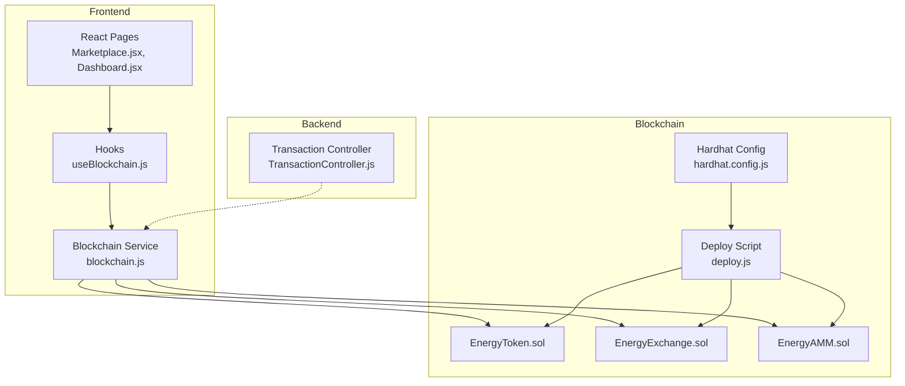
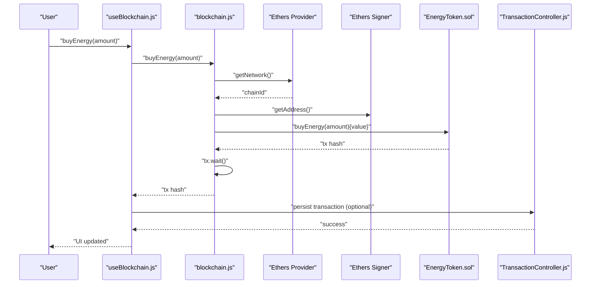
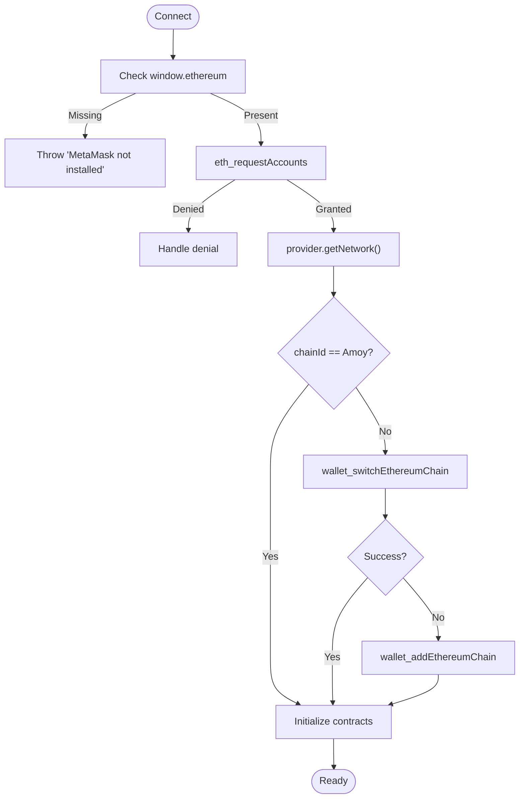
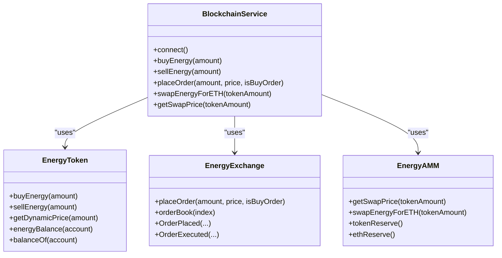
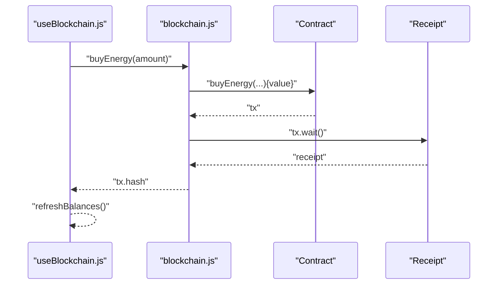
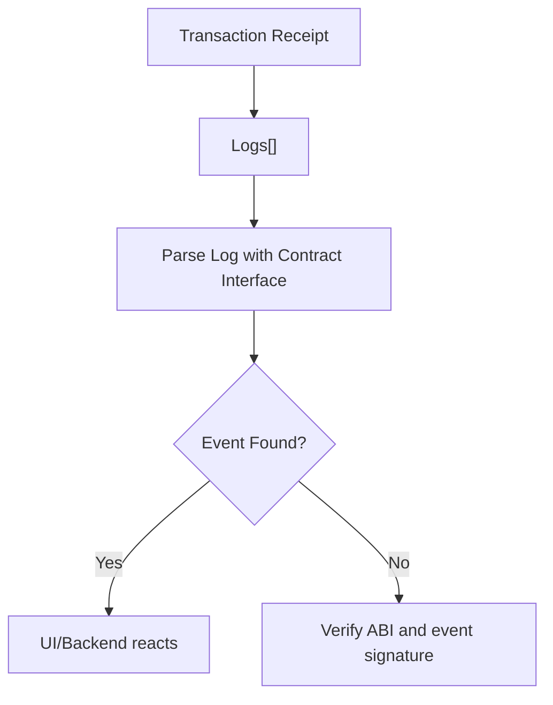
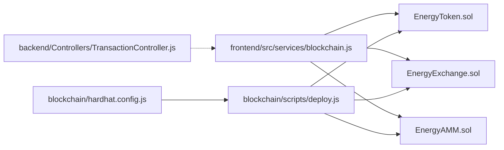

# Blockchain Debugging

<cite>
**Referenced Files in This Document**
- [EnergyToken.sol](file://blockchain/contracts/EnergyToken.sol)
- [EnergyExchange.sol](file://blockchain/contracts/EnergyExchange.sol)
- [EnergyAMM.sol](file://blockchain/contracts/EnergyAMM.sol)
- [blockchain.js](file://frontend/src/services/blockchain.js)
- [useBlockchain.js](file://frontend/src/hooks/useBlockchain.js)
- [TransactionController.js](file://backend/Controllers/TransactionController.js)
- [deploy.js](file://blockchain/scripts/deploy.js)
- [hardhat.config.js](file://blockchain/hardhat.config.js)
- [EnergyToken.test.js](file://blockchain/test/EnergyToken.test.js)
- [EnergyExchange.test.js](file://blockchain/test/EnergyExchange.test.js)
- [EnergyAMM.test.js](file://blockchain/test/EnergyAMM.test.js)
- [Marketplace.jsx](file://frontend/src/frontend/Marketplace.jsx)
- [Dashboard.jsx](file://frontend/src/frontend/Dashboard.jsx)
</cite>

## Table of Contents
1. [Introduction](#introduction)
2. [Project Structure](#project-structure)
3. [Core Components](#core-components)
4. [Architecture Overview](#architecture-overview)
5. [Detailed Component Analysis](#detailed-component-analysis)
6. [Dependency Analysis](#dependency-analysis)
7. [Performance Considerations](#performance-considerations)
8. [Troubleshooting Guide](#troubleshooting-guide)
9. [Conclusion](#conclusion)
10. [Appendices](#appendices)

## Introduction
This document provides comprehensive blockchain debugging guidance for the Ecogrid project. It focuses on diagnosing and resolving issues related to:
- Smart contract interactions (EnergyToken, EnergyExchange, EnergyAMM)
- Wallet connectivity via MetaMask and network switching
- Transaction processing and receipts
- Event listening and ABI correctness
- Polygon Amoy testnet connectivity and RPC reliability
- Transaction stuck scenarios, nonce management, and gas optimization
- Debugging tools and techniques (Hardhat console.log, contract state inspection, transaction simulation)

The goal is to help developers quickly identify root causes and apply targeted fixes across frontend, backend, and smart contracts.

## Project Structure
The project is organized into three main layers:
- Frontend (React): Wallet connection, UI interactions, and blockchain service integration
- Backend (Node.js): Transaction persistence and user data
- Blockchain (Solidity + Hardhat): Smart contracts and deployment scripts

**Diagram sources**
- [blockchain.js](file://frontend/src/services/blockchain.js#L42-L261)
- [useBlockchain.js](file://frontend/src/hooks/useBlockchain.js#L1-L155)
- [EnergyToken.sol](file://blockchain/contracts/EnergyToken.sol#L1-L55)
- [EnergyExchange.sol](file://blockchain/contracts/EnergyExchange.sol#L1-L45)
- [EnergyAMM.sol](file://blockchain/contracts/EnergyAMM.sol#L1-L24)
- [deploy.js](file://blockchain/scripts/deploy.js#L1-L29)
- [hardhat.config.js](file://blockchain/hardhat.config.js#L1-L12)

**Section sources**
- [blockchain.js](file://frontend/src/services/blockchain.js#L42-L261)
- [useBlockchain.js](file://frontend/src/hooks/useBlockchain.js#L1-L155)
- [EnergyToken.sol](file://blockchain/contracts/EnergyToken.sol#L1-L55)
- [EnergyExchange.sol](file://blockchain/contracts/EnergyExchange.sol#L1-L45)
- [EnergyAMM.sol](file://blockchain/contracts/EnergyAMM.sol#L1-L24)
- [deploy.js](file://blockchain/scripts/deploy.js#L1-L29)
- [hardhat.config.js](file://blockchain/hardhat.config.js#L1-L12)

## Core Components
- Blockchain Service: Manages MetaMask provider/signer, network switching to Polygon Amoy, contract initialization, and transaction lifecycle.
- Hooks: Centralized state and error handling for wallet and blockchain operations.
- Controllers: Persist and query user transactions.
- Smart Contracts: EnergyToken (ERC20 + custom balances), EnergyExchange (order book and matching), EnergyAMM (constant product liquidity pool).

Key responsibilities:
- Wallet connectivity and network checks
- ABI correctness and contract address configuration
- Transaction submission, waiting, and receipt handling
- Event parsing and UI feedback
- Backend transaction persistence

**Section sources**
- [blockchain.js](file://frontend/src/services/blockchain.js#L42-L261)
- [useBlockchain.js](file://frontend/src/hooks/useBlockchain.js#L1-L155)
- [TransactionController.js](file://backend/Controllers/TransactionController.js#L1-L68)
- [EnergyToken.sol](file://blockchain/contracts/EnergyToken.sol#L1-L55)
- [EnergyExchange.sol](file://blockchain/contracts/EnergyExchange.sol#L1-L45)
- [EnergyAMM.sol](file://blockchain/contracts/EnergyAMM.sol#L1-L24)

## Architecture Overview
End-to-end flow for a typical trade operation:
1. User connects wallet and switches to Polygon Amoy
2. Frontend initializes contracts using configured addresses and ABI
3. User initiates a trade (buy/sell/swap)
4. Frontend submits transaction via signer and waits for receipt
5. Backend persists transaction metadata upon completion
6. UI reflects updated balances and transaction history

**Diagram sources**
- [useBlockchain.js](file://frontend/src/hooks/useBlockchain.js#L46-L60)
- [blockchain.js](file://frontend/src/services/blockchain.js#L164-L176)
- [EnergyToken.sol](file://blockchain/contracts/EnergyToken.sol#L21-L30)
- [TransactionController.js](file://backend/Controllers/TransactionController.js#L18-L67)

## Detailed Component Analysis

### Wallet Connectivity and Network Switching
Common issues:
- MetaMask not installed or not detected
- User denies account access
- Incorrect network (not Polygon Amoy)
- Chain not added automatically

Diagnostics:
- Verify MetaMask availability and request accounts
- Confirm chainId matches Polygon Amoy
- Attempt wallet_switchEthereumChain; fallback to wallet_addEthereumChain
- Listen for accountsChanged and chainChanged events

**Diagram sources**
- [blockchain.js](file://frontend/src/services/blockchain.js#L52-L130)

**Section sources**
- [blockchain.js](file://frontend/src/services/blockchain.js#L52-L130)
- [useBlockchain.js](file://frontend/src/hooks/useBlockchain.js#L118-L134)

### Smart Contract Interactions
- EnergyToken: buyEnergy, sellEnergy, getDynamicPrice, energyBalance
- EnergyExchange: placeOrder, orderBook, OrderPlaced, OrderExecuted
- EnergyAMM: getSwapPrice, swapEnergyForETH, tokenReserve, ethReserve

Debugging tips:
- Validate ABI completeness and function signatures
- Ensure contract addresses are configured before initialization
- Parse logs/events to confirm successful execution
- Use test suites to simulate failure modes (insufficient funds, insufficient tokens, mismatched prices)

**Diagram sources**
- [blockchain.js](file://frontend/src/services/blockchain.js#L42-L261)
- [EnergyToken.sol](file://blockchain/contracts/EnergyToken.sol#L1-L55)
- [EnergyExchange.sol](file://blockchain/contracts/EnergyExchange.sol#L1-L45)
- [EnergyAMM.sol](file://blockchain/contracts/EnergyAMM.sol#L1-L24)

**Section sources**
- [blockchain.js](file://frontend/src/services/blockchain.js#L139-L224)
- [EnergyToken.sol](file://blockchain/contracts/EnergyToken.sol#L21-L47)
- [EnergyExchange.sol](file://blockchain/contracts/EnergyExchange.sol#L17-L43)
- [EnergyAMM.sol](file://blockchain/contracts/EnergyAMM.sol#L8-L20)

### Transaction Processing and Receipt Handling
- Frontend: submit transaction, await receipt, return tx hash
- Backend: persist transaction records with status and counterparty

Common pitfalls:
- Not awaiting tx.wait() before reporting success
- Missing error handling around transaction submission
- Backend not receiving or storing txHash

**Diagram sources**
- [useBlockchain.js](file://frontend/src/hooks/useBlockchain.js#L46-L60)
- [blockchain.js](file://frontend/src/services/blockchain.js#L164-L176)

**Section sources**
- [useBlockchain.js](file://frontend/src/hooks/useBlockchain.js#L46-L60)
- [blockchain.js](file://frontend/src/services/blockchain.js#L164-L188)
- [TransactionController.js](file://backend/Controllers/TransactionController.js#L18-L67)

### Event Listening and ABI Mismatches
- Events emitted: EnergyBought, EnergySold, OrderPlaced, OrderExecuted
- ABI must include both function signatures and event definitions
- Use interface.parseLog on logs to detect emitted events

**Diagram sources**
- [EnergyToken.test.js](file://blockchain/test/EnergyToken.test.js#L144-L150)
- [EnergyExchange.test.js](file://blockchain/test/EnergyExchange.test.js#L35-L56)

**Section sources**
- [EnergyToken.test.js](file://blockchain/test/EnergyToken.test.js#L137-L150)
- [EnergyExchange.test.js](file://blockchain/test/EnergyExchange.test.js#L27-L56)

### Polygon Amoy Testnet Connectivity
- Frontend attempts wallet_switchEthereumChain; adds chain if missing
- Hardhat config defines amoy network URL and private key
- RPC endpoint failures can cause provider.getNetwork to fail

Checklist:
- Ensure RPC URL is reachable
- Confirm chainId and explorer URLs are correct
- Handle 4902 (chain not added) error during switch/add

**Section sources**
- [blockchain.js](file://frontend/src/services/blockchain.js#L103-L130)
- [hardhat.config.js](file://blockchain/hardhat.config.js#L6-L11)

### Transaction Stuck Scenarios, Nonce, and Gas Optimization
Symptoms:
- Transactions remain pending for long periods
- Frequent “replacement underpriced” errors
- Nonce too low/high errors

Mitigations:
- Monitor gas price and estimate gas before sending
- Use dynamic gas fees (EIP-1559) when supported
- Implement nonce management (fetch latest nonce per account)
- Retry with higher gas price or replacement transaction

Note: The current frontend code does not explicitly set gas price/gas limit; rely on provider defaults. Consider adding gas estimation and configurable gas parameters for production.

**Section sources**
- [blockchain.js](file://frontend/src/services/blockchain.js#L164-L176)

### Debugging Tools and Techniques
- Hardhat console.log: Use Hardhat’s console logging in Solidity for quick diagnostics during development and testing.
- Contract state inspection: Query state variables directly via frontend service methods (e.g., tokenReserve, ethReserve, balances).
- Transaction simulation: Reproduce issues in Hardhat tests using signers and transaction receipts.

Examples from tests:
- Dynamic pricing and event emission verification
- Order matching and partial fills
- AMM swap price calculation and pool reserve updates

**Section sources**
- [EnergyToken.test.js](file://blockchain/test/EnergyToken.test.js#L63-L81)
- [EnergyExchange.test.js](file://blockchain/test/EnergyExchange.test.js#L88-L154)
- [EnergyAMM.test.js](file://blockchain/test/EnergyAMM.test.js#L40-L77)

## Dependency Analysis
- Frontend depends on MetaMask provider and Ethers.js for wallet and contract interactions
- Contracts depend on OpenZeppelin ERC20 and Ownable
- Backend depends on MongoDB/Mongoose models and persists transactions
- Deployment script depends on Hardhat runtime environment

**Diagram sources**
- [blockchain.js](file://frontend/src/services/blockchain.js#L42-L261)
- [EnergyToken.sol](file://blockchain/contracts/EnergyToken.sol#L1-L55)
- [EnergyExchange.sol](file://blockchain/contracts/EnergyExchange.sol#L1-L45)
- [EnergyAMM.sol](file://blockchain/contracts/EnergyAMM.sol#L1-L24)
- [deploy.js](file://blockchain/scripts/deploy.js#L1-L29)
- [hardhat.config.js](file://blockchain/hardhat.config.js#L1-L12)
- [TransactionController.js](file://backend/Controllers/TransactionController.js#L1-L68)

**Section sources**
- [blockchain.js](file://frontend/src/services/blockchain.js#L42-L261)
- [deploy.js](file://blockchain/scripts/deploy.js#L1-L29)
- [hardhat.config.js](file://blockchain/hardhat.config.js#L1-L12)
- [TransactionController.js](file://backend/Controllers/TransactionController.js#L1-L68)

## Performance Considerations
- Minimize repeated provider calls by caching balances and reserves
- Batch UI updates to avoid excessive re-renders
- Use polling intervals judiciously for real-time data
- Optimize ABI to include only necessary functions and events

## Troubleshooting Guide

### Wallet and Network Issues
- MetaMask not detected: Ensure MetaMask is installed and unlocked; check browser extension compatibility.
- Account access denied: Prompt user to unlock MetaMask and retry.
- Wrong network: Use switchToPolygonAmoy; handle 4902 error to add chain automatically.
- Network latency: Verify RPC endpoint availability; consider fallback endpoints.

**Section sources**
- [blockchain.js](file://frontend/src/services/blockchain.js#L52-L130)

### ABI and Function Signature Errors
- Symptoms: “Method not found,” “Invalid number of arguments,” or missing events
- Resolution: Ensure ABI includes both function signatures and event definitions; verify function names and parameter types match contracts.

**Section sources**
- [blockchain.js](file://frontend/src/services/blockchain.js#L4-L29)

### Transaction Submission Failures
- Insufficient funds: Ensure wallet has sufficient ETH for gas and value where required.
- Contract reverts: Validate preconditions (e.g., sufficient tokens, correct pricing).
- Pending transactions: Increase gas price or replace transaction; monitor nonce.

**Section sources**
- [EnergyToken.sol](file://blockchain/contracts/EnergyToken.sol#L21-L47)
- [EnergyAMM.sol](file://blockchain/contracts/EnergyAMM.sol#L12-L20)

### Event Parsing Problems
- Missing events: Confirm ABI includes event definitions; parse logs using contract interface.
- Event mismatch: Verify event names and indexed parameters align with emitted logs.

**Section sources**
- [EnergyToken.test.js](file://blockchain/test/EnergyToken.test.js#L144-L150)
- [EnergyExchange.test.js](file://blockchain/test/EnergyExchange.test.js#L35-L56)

### Backend Transaction Persistence
- Missing txHash: Ensure frontend awaits tx.wait() and passes txHash to backend.
- Duplicate records: Use unique identifiers and idempotency checks in backend.

**Section sources**
- [TransactionController.js](file://backend/Controllers/TransactionController.js#L18-L67)

### UI and State Synchronization
- Balances not updating: Call refreshBalances after successful transactions.
- Network changes: Reload page on chainChanged to reset state.

**Section sources**
- [useBlockchain.js](file://frontend/src/hooks/useBlockchain.js#L33-L44)
- [useBlockchain.js](file://frontend/src/hooks/useBlockchain.js#L118-L134)

## Conclusion
This guide consolidates practical debugging strategies for Ecogrid’s blockchain stack. By validating wallet connectivity, ensuring ABI correctness, handling receipts robustly, and leveraging Hardhat tests, teams can rapidly isolate and resolve issues across frontend, backend, and smart contracts. For production, incorporate explicit gas estimation, nonce management, and resilient RPC configurations to minimize stuck transactions and improve user experience.

## Appendices

### Common Error Messages and Resolutions
- “MetaMask is not installed”: Install and enable MetaMask; reload page.
- “Not connected”: Trigger connect flow; ensure accounts are approved.
- “Contract not initialized”: Verify contract addresses are configured before use.
- “Not enough ETH in pool”: Deposit ETH into AMM pool or reduce swap amount.
- “Not enough energy tokens”: Mint or transfer tokens to the contract or user.
- “Insufficient ETH sent”: Send exact ETH amount or increase value.
- “Chain not added”: Handle 4902 error and call wallet_addEthereumChain.

**Section sources**
- [blockchain.js](file://frontend/src/services/blockchain.js#L52-L130)
- [blockchain.js](file://frontend/src/services/blockchain.js#L164-L188)
- [EnergyAMM.sol](file://blockchain/contracts/EnergyAMM.sol#L12-L20)
- [EnergyToken.sol](file://blockchain/contracts/EnergyToken.sol#L21-L47)

### Useful Frontend Utilities
- Blockchain service methods for balances, prices, and reserves
- Hook-driven state management for UI updates
- Transaction history display with links to Polygonscan

**Section sources**
- [blockchain.js](file://frontend/src/services/blockchain.js#L139-L238)
- [useBlockchain.js](file://frontend/src/hooks/useBlockchain.js#L1-L155)
- [Marketplace.jsx](file://frontend/src/frontend/Marketplace.jsx#L547-L551)
- [Dashboard.jsx](file://frontend/src/frontend/Dashboard.jsx#L1-L556)