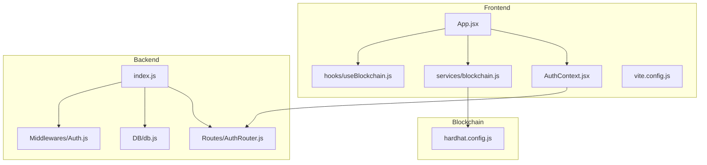
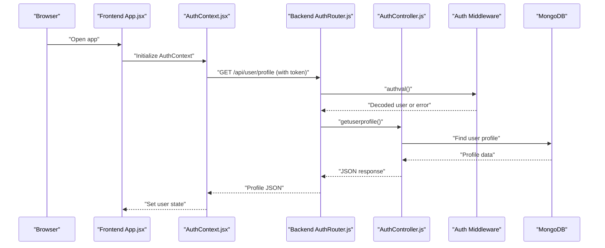
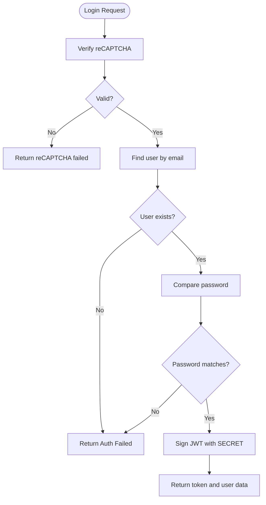
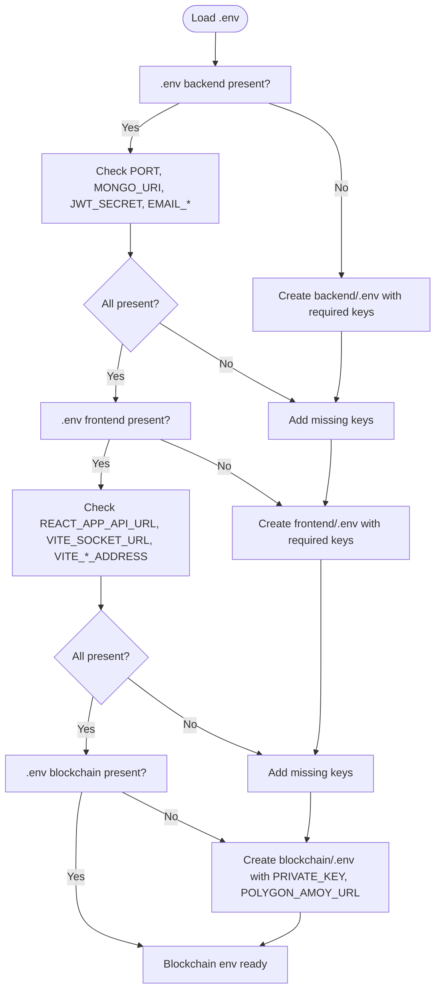
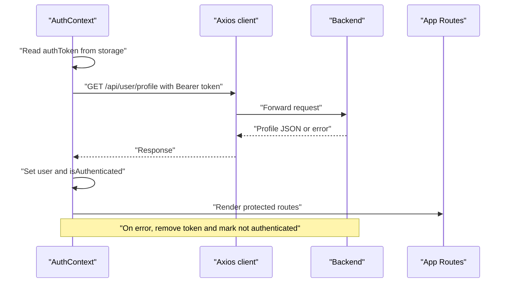
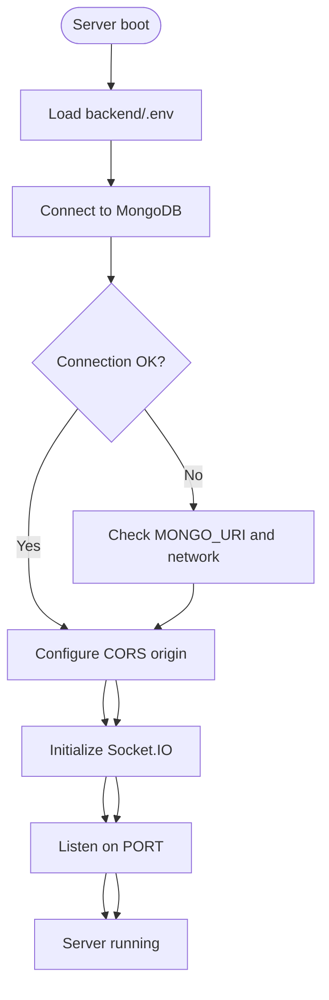
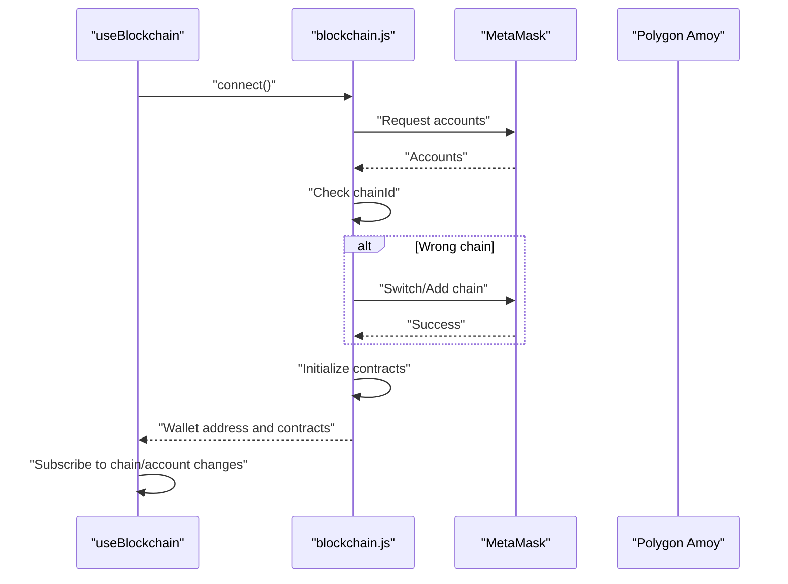
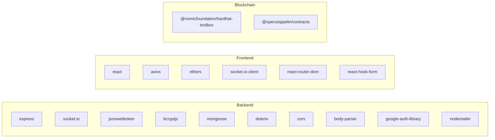

# Common Issues

<cite>
**Referenced Files in This Document**
- [backend/.env](file://backend/.env)
- [frontend/.env](file://frontend/.env)
- [blockchain/.env](file://blockchain/.env)
- [backend/package.json](file://backend/package.json)
- [frontend/package.json](file://frontend/package.json)
- [blockchain/package.json](file://blockchain/package.json)
- [backend/index.js](file://backend/index.js)
- [backend/Routes/AuthRouter.js](file://backend/Routes/AuthRouter.js)
- [backend/Controllers/AuthController.js](file://backend/Controllers/AuthController.js)
- [backend/Middlewares/Auth.js](file://backend/Middlewares/Auth.js)
- [backend/DB/db.js](file://backend/DB/db.js)
- [frontend/src/Context/AuthContext.jsx](file://frontend/src/Context/AuthContext.jsx)
- [frontend/src/App.jsx](file://frontend/src/App.jsx)
- [frontend/src/services/blockchain.js](file://frontend/src/services/blockchain.js)
- [frontend/src/hooks/useBlockchain.js](file://frontend/src/hooks/useBlockchain.js)
- [frontend/vite.config.js](file://frontend/vite.config.js)
- [blockchain/hardhat.config.js](file://blockchain/hardhat.config.js)
- [frontend/src/api.js](file://frontend/src/api.js)
</cite>

## Table of Contents
1. [Introduction](#introduction)
2. [Project Structure](#project-structure)
3. [Core Components](#core-components)
4. [Architecture Overview](#architecture-overview)
5. [Detailed Component Analysis](#detailed-component-analysis)
6. [Dependency Analysis](#dependency-analysis)
7. [Performance Considerations](#performance-considerations)
8. [Troubleshooting Guide](#troubleshooting-guide)
9. [Conclusion](#conclusion)
10. [Appendices](#appendices)

## Introduction
This document provides a comprehensive troubleshooting guide for common issues encountered during EcoGrid development and deployment. It focuses on:
- Authentication problems: JWT token expiration, session timeout, login failures, and reCAPTCHA/GitHub OAuth integration.
- Environment configuration: missing or incorrect .env variables, API endpoints, and database connection strings.
- Frontend-specific issues: component rendering, state management, build failures, and blockchain integration.
- Backend API connectivity: port binding, CORS misconfiguration, and Socket.IO setup.
- Blockchain integration: wallet connection, network switching, and contract deployment/address configuration.

Each section includes step-by-step diagnostics and quick fixes, with references to the relevant source files.

## Project Structure
EcoGrid is a full-stack application composed of:
- Backend (Node.js + Express): Authentication, routing, middleware, database, and WebSocket support.
- Frontend (React + Vite): Authentication context, UI components, blockchain hooks, and API clients.
- Blockchain (Hardhat): Smart contracts, deployment scripts, and local testing environment.

**Diagram sources**
- [frontend/src/App.jsx](file://frontend/src/App.jsx#L1-L79)
- [frontend/src/Context/AuthContext.jsx](file://frontend/src/Context/AuthContext.jsx#L1-L70)
- [frontend/src/services/blockchain.js](file://frontend/src/services/blockchain.js#L1-L261)
- [frontend/src/hooks/useBlockchain.js](file://frontend/src/hooks/useBlockchain.js#L1-L155)
- [frontend/vite.config.js](file://frontend/vite.config.js#L1-L18)
- [backend/index.js](file://backend/index.js#L1-L97)
- [backend/Routes/AuthRouter.js](file://backend/Routes/AuthRouter.js#L1-L15)
- [backend/Middlewares/Auth.js](file://backend/Middlewares/Auth.js#L1-L19)
- [backend/DB/db.js](file://backend/DB/db.js#L1-L12)
- [blockchain/hardhat.config.js](file://blockchain/hardhat.config.js#L1-L12)

**Section sources**
- [backend/package.json](file://backend/package.json#L1-L29)
- [frontend/package.json](file://frontend/package.json#L1-L50)
- [blockchain/package.json](file://blockchain/package.json#L1-L11)

## Core Components
- Authentication flow: JWT-based login and protected routes, plus Google OAuth and reCAPTCHA.
- Environment configuration: .env files for backend, frontend, and blockchain.
- Frontend state and blockchain integration: AuthContext, useBlockchain hook, and blockchain service.
- Backend server: Express server with Socket.IO and CORS configuration.
- Database: MongoDB connection via Mongoose.

Key implementation references:
- Authentication controller and middleware: [backend/Controllers/AuthController.js](file://backend/Controllers/AuthController.js#L1-L482), [backend/Middlewares/Auth.js](file://backend/Middlewares/Auth.js#L1-L19)
- Backend server and routes: [backend/index.js](file://backend/index.js#L1-L97), [backend/Routes/AuthRouter.js](file://backend/Routes/AuthRouter.js#L1-L15)
- Frontend authentication context: [frontend/src/Context/AuthContext.jsx](file://frontend/src/Context/AuthContext.jsx#L1-L70)
- Frontend blockchain service and hook: [frontend/src/services/blockchain.js](file://frontend/src/services/blockchain.js#L1-L261), [frontend/src/hooks/useBlockchain.js](file://frontend/src/hooks/useBlockchain.js#L1-L155)
- Database connection: [backend/DB/db.js](file://backend/DB/db.js#L1-L12)
- Environment variables: [backend/.env](file://backend/.env#L1-L13), [frontend/.env](file://frontend/.env#L1-L7), [blockchain/.env](file://blockchain/.env#L1-L2)

**Section sources**
- [backend/Controllers/AuthController.js](file://backend/Controllers/AuthController.js#L105-L155)
- [backend/Middlewares/Auth.js](file://backend/Middlewares/Auth.js#L3-L18)
- [backend/index.js](file://backend/index.js#L14-L46)
- [frontend/src/Context/AuthContext.jsx](file://frontend/src/Context/AuthContext.jsx#L17-L46)
- [frontend/src/services/blockchain.js](file://frontend/src/services/blockchain.js#L52-L101)
- [frontend/src/hooks/useBlockchain.js](file://frontend/src/hooks/useBlockchain.js#L17-L31)
- [backend/DB/db.js](file://backend/DB/db.js#L3-L10)
- [backend/.env](file://backend/.env#L1-L13)
- [frontend/.env](file://frontend/.env#L1-L7)
- [blockchain/.env](file://blockchain/.env#L1-L2)

## Architecture Overview
The system integrates frontend, backend, and blockchain layers with real-time communication and secure authentication.

**Diagram sources**
- [frontend/src/App.jsx](file://frontend/src/App.jsx#L1-L79)
- [frontend/src/Context/AuthContext.jsx](file://frontend/src/Context/AuthContext.jsx#L17-L46)
- [backend/Routes/AuthRouter.js](file://backend/Routes/AuthRouter.js#L10-L12)
- [backend/Controllers/AuthController.js](file://backend/Controllers/AuthController.js#L196-L219)
- [backend/Middlewares/Auth.js](file://backend/Middlewares/Auth.js#L3-L18)
- [backend/DB/db.js](file://backend/DB/db.js#L3-L10)

## Detailed Component Analysis

### Authentication and Session Management
Common issues:
- JWT token expiration and session timeout.
- Login failures due to invalid credentials or reCAPTCHA errors.
- Protected route access denied.

Diagnostics and fixes:
- Verify JWT_SECRET and token expiration in login flow.
- Ensure Authorization header starts with "Bearer ".
- Confirm reCAPTCHA secret key and site key match configuration.
- Check frontend token persistence and middleware error messages.

**Diagram sources**
- [backend/Controllers/AuthController.js](file://backend/Controllers/AuthController.js#L105-L155)
- [backend/Middlewares/Auth.js](file://backend/Middlewares/Auth.js#L3-L18)

**Section sources**
- [backend/Controllers/AuthController.js](file://backend/Controllers/AuthController.js#L105-L155)
- [backend/Middlewares/Auth.js](file://backend/Middlewares/Auth.js#L3-L18)
- [backend/Routes/AuthRouter.js](file://backend/Routes/AuthRouter.js#L7-L14)
- [frontend/src/Context/AuthContext.jsx](file://frontend/src/Context/AuthContext.jsx#L17-L46)

### Environment Configuration
Common issues:
- Missing or empty .env variables causing runtime errors.
- Incorrect API base URLs and Socket.IO origins.
- Database connection string errors.

Diagnostics and fixes:
- Validate backend .env keys: PORT, MONGO_URI, JWT_SECRET, EMAIL_*.
- Validate frontend .env keys: REACT_APP_API_URL, VITE_SOCKET_URL, VITE_*_ADDRESS.
- Validate blockchain .env keys: PRIVATE_KEY, POLYGON_AMOY_URL.
- Ensure Vite defines environment variables correctly.

**Diagram sources**
- [backend/.env](file://backend/.env#L1-L13)
- [frontend/.env](file://frontend/.env#L1-L7)
- [blockchain/.env](file://blockchain/.env#L1-L2)
- [frontend/vite.config.js](file://frontend/vite.config.js#L14-L16)

**Section sources**
- [backend/.env](file://backend/.env#L1-L13)
- [frontend/.env](file://frontend/.env#L1-L7)
- [blockchain/.env](file://blockchain/.env#L1-L2)
- [frontend/vite.config.js](file://frontend/vite.config.js#L14-L16)

### Frontend-Specific Problems
Common issues:
- Component rendering errors due to missing tokens or user data.
- State management inconsistencies (isAuthenticated, user).
- Build failures related to environment variables.

Diagnostics and fixes:
- Ensure REACT_APP_API_URL matches backend port and origin.
- Confirm Vite injects environment variables via define config.
- Validate AuthContext fetches profile and clears stale tokens.
- Check private route protection and toast notifications.

**Diagram sources**
- [frontend/src/Context/AuthContext.jsx](file://frontend/src/Context/AuthContext.jsx#L17-L46)
- [frontend/src/App.jsx](file://frontend/src/App.jsx#L38-L47)

**Section sources**
- [frontend/src/Context/AuthContext.jsx](file://frontend/src/Context/AuthContext.jsx#L17-L46)
- [frontend/src/App.jsx](file://frontend/src/App.jsx#L38-L47)
- [frontend/vite.config.js](file://frontend/vite.config.js#L14-L16)

### Backend API Connectivity and Startup
Common issues:
- Port binding conflicts and server startup failures.
- CORS misconfiguration blocking frontend requests.
- Socket.IO origin mismatch.

Diagnostics and fixes:
- Verify PORT in backend/.env and ensure it is free.
- Confirm CORS origin matches frontend URL.
- Ensure Socket.IO origin and credentials align with frontend.
- Check database connection string and network accessibility.

**Diagram sources**
- [backend/index.js](file://backend/index.js#L26-L46)
- [backend/DB/db.js](file://backend/DB/db.js#L3-L10)
- [backend/.env](file://backend/.env#L1-L2)

**Section sources**
- [backend/index.js](file://backend/index.js#L26-L46)
- [backend/DB/db.js](file://backend/DB/db.js#L3-L10)
- [backend/.env](file://backend/.env#L1-L2)

### Blockchain Integration
Common issues:
- Wallet connection timeouts and MetaMask not installed.
- Network switching failures (Polygon Amoy).
- Contract addresses not configured in environment.

Diagnostics and fixes:
- Ensure MetaMask is installed and accounts are unlocked.
- Verify RPC URL and chain ID for Polygon Amoy.
- Confirm VITE_ENERGY_*_ADDRESS are set post-deployment.
- Handle chainChanged and accountsChanged events.

**Diagram sources**
- [frontend/src/hooks/useBlockchain.js](file://frontend/src/hooks/useBlockchain.js#L17-L31)
- [frontend/src/services/blockchain.js](file://frontend/src/services/blockchain.js#L52-L101)
- [frontend/.env](file://frontend/.env#L1-L4)

**Section sources**
- [frontend/src/services/blockchain.js](file://frontend/src/services/blockchain.js#L52-L101)
- [frontend/src/hooks/useBlockchain.js](file://frontend/src/hooks/useBlockchain.js#L118-L134)
- [frontend/.env](file://frontend/.env#L1-L4)
- [blockchain/hardhat.config.js](file://blockchain/hardhat.config.js#L7-L11)

## Dependency Analysis
Runtime dependencies and their roles:
- Backend: Express, Socket.IO, JWT, bcrypt, mongoose, dotenv, cors, body-parser, google-auth-library, nodemailer.
- Frontend: React, axios, ethers, socket.io-client, react-router-dom, react-hook-form, radix-ui, lucide-react, tailwindcss.
- Blockchain: Hardhat, @nomicfoundation/hardhat-toolbox, @openzeppelin/contracts, dotenv.

**Diagram sources**
- [backend/package.json](file://backend/package.json#L13-L26)
- [frontend/package.json](file://frontend/package.json#L12-L32)
- [blockchain/package.json](file://blockchain/package.json#L2-L9)

**Section sources**
- [backend/package.json](file://backend/package.json#L13-L26)
- [frontend/package.json](file://frontend/package.json#L12-L32)
- [blockchain/package.json](file://blockchain/package.json#L2-L9)

## Performance Considerations
- Minimize unnecessary re-renders in AuthContext and useBlockchain hook.
- Debounce or throttle blockchain queries to reduce provider load.
- Use environment-specific logging and avoid verbose logs in production.
- Optimize Socket.IO rooms and event handling to prevent memory leaks.

[No sources needed since this section provides general guidance]

## Troubleshooting Guide

### Authentication Problems
Symptoms:
- JWT token expiration or session timeout errors.
- Login failures with reCAPTCHA or credential errors.
- Protected routes redirecting unauthenticated users.

Quick fixes:
- Regenerate token after expiration; ensure frontend stores token securely.
- Verify reCAPTCHA secret key and site key in backend and frontend .env.
- Confirm Authorization header format and middleware decoding.
- Clear localStorage/sessionStorage tokens on logout and error.

Diagnostics references:
- JWT signing and verification: [backend/Controllers/AuthController.js](file://backend/Controllers/AuthController.js#L135-L139), [backend/Middlewares/Auth.js](file://backend/Middlewares/Auth.js#L10-L17)
- Login flow and error responses: [backend/Controllers/AuthController.js](file://backend/Controllers/AuthController.js#L105-L155)
- Protected routes: [backend/Routes/AuthRouter.js](file://backend/Routes/AuthRouter.js#L10-L12)
- Frontend token handling: [frontend/src/Context/AuthContext.jsx](file://frontend/src/Context/AuthContext.jsx#L17-L46)

**Section sources**
- [backend/Controllers/AuthController.js](file://backend/Controllers/AuthController.js#L105-L155)
- [backend/Middlewares/Auth.js](file://backend/Middlewares/Auth.js#L10-L17)
- [backend/Routes/AuthRouter.js](file://backend/Routes/AuthRouter.js#L10-L12)
- [frontend/src/Context/AuthContext.jsx](file://frontend/src/Context/AuthContext.jsx#L17-L46)

### Environment Configuration Issues
Symptoms:
- Application crashes due to missing environment variables.
- Frontend cannot reach backend API.
- Database connection refused.

Quick fixes:
- Populate backend/.env with PORT, MONGO_URI, JWT_SECRET, EMAIL_*, GOOGLE_CLIENT_ID/SECRET.
- Populate frontend/.env with REACT_APP_API_URL, VITE_SOCKET_URL, VITE_ENERGY_*_ADDRESS, VITE_GOOGLE_CLIENT_ID.
- Populate blockchain/.env with PRIVATE_KEY, POLYGON_AMOY_URL.
- Ensure Vite injects environment variables via define config.

Diagnostics references:
- Backend .env keys: [backend/.env](file://backend/.env#L1-L13)
- Frontend .env keys: [frontend/.env](file://frontend/.env#L1-L7)
- Blockchain .env keys: [blockchain/.env](file://blockchain/.env#L1-L2)
- Vite environment injection: [frontend/vite.config.js](file://frontend/vite.config.js#L14-L16)

**Section sources**
- [backend/.env](file://backend/.env#L1-L13)
- [frontend/.env](file://frontend/.env#L1-L7)
- [blockchain/.env](file://blockchain/.env#L1-L2)
- [frontend/vite.config.js](file://frontend/vite.config.js#L14-L16)

### Frontend-Specific Problems
Symptoms:
- Blank screen or loading indefinitely.
- Protected routes show unauthorized warnings.
- Build fails due to environment variables.

Quick fixes:
- Ensure REACT_APP_API_URL matches backend port and origin.
- Confirm Vite define config does not override process.env unexpectedly.
- Verify AuthContext fetches profile and clears invalid tokens.
- Use toast notifications for user feedback on route access.

Diagnostics references:
- AuthContext token retrieval and profile fetch: [frontend/src/Context/AuthContext.jsx](file://frontend/src/Context/AuthContext.jsx#L17-L46)
- Private route protection: [frontend/src/App.jsx](file://frontend/src/App.jsx#L38-L47)
- Vite environment injection: [frontend/vite.config.js](file://frontend/vite.config.js#L14-L16)

**Section sources**
- [frontend/src/Context/AuthContext.jsx](file://frontend/src/Context/AuthContext.jsx#L17-L46)
- [frontend/src/App.jsx](file://frontend/src/App.jsx#L38-L47)
- [frontend/vite.config.js](file://frontend/vite.config.js#L14-L16)

### Backend API Connectivity and Startup Failures
Symptoms:
- Server fails to start or binds to wrong port.
- CORS errors blocking frontend requests.
- Socket.IO handshake failures.

Quick fixes:
- Change PORT in backend/.env if in use; restart server.
- Align CORS origin with frontend URL.
- Match Socket.IO origin and credentials with frontend.
- Verify MongoDB URI and network accessibility.

Diagnostics references:
- Server initialization and ports: [backend/index.js](file://backend/index.js#L26-L46)
- Database connection: [backend/DB/db.js](file://backend/DB/db.js#L3-L10)
- Backend .env: [backend/.env](file://backend/.env#L1-L2)

**Section sources**
- [backend/index.js](file://backend/index.js#L26-L46)
- [backend/DB/db.js](file://backend/DB/db.js#L3-L10)
- [backend/.env](file://backend/.env#L1-L2)

### Blockchain-Related Issues
Symptoms:
- MetaMask not detected or connection timeout.
- Network switching to Polygon Amoy fails.
- Contract interactions fail due to uninitialized contracts.

Quick fixes:
- Install MetaMask and unlock account.
- Verify RPC URL and chain ID for Polygon Amoy.
- Set VITE_ENERGY_TOKEN_ADDRESS, VITE_ENERGY_EXCHANGE_ADDRESS, VITE_ENERGY_AMM_ADDRESS after deployment.
- Handle chainChanged and accountsChanged events to keep UI in sync.

Diagnostics references:
- Wallet connection and network switching: [frontend/src/services/blockchain.js](file://frontend/src/services/blockchain.js#L52-L101)
- Hook for connection and balances: [frontend/src/hooks/useBlockchain.js](file://frontend/src/hooks/useBlockchain.js#L17-L31)
- Frontend .env contract addresses: [frontend/.env](file://frontend/.env#L1-L4)
- Hardhat network configuration: [blockchain/hardhat.config.js](file://blockchain/hardhat.config.js#L7-L11)

**Section sources**
- [frontend/src/services/blockchain.js](file://frontend/src/services/blockchain.js#L52-L101)
- [frontend/src/hooks/useBlockchain.js](file://frontend/src/hooks/useBlockchain.js#L17-L31)
- [frontend/.env](file://frontend/.env#L1-L4)
- [blockchain/hardhat.config.js](file://blockchain/hardhat.config.js#L7-L11)

## Conclusion
This guide consolidates actionable diagnostics and fixes for the most frequent issues in EcoGrid. By validating environment variables, ensuring proper authentication flows, configuring CORS and Socket.IO, and handling blockchain integration carefully, teams can maintain a robust development and deployment pipeline.

[No sources needed since this section summarizes without analyzing specific files]

## Appendices

### Quick Checklist
- Backend: PORT, MONGO_URI, JWT_SECRET, EMAIL_*, GOOGLE_CLIENT_ID/SECRET present.
- Frontend: REACT_APP_API_URL, VITE_SOCKET_URL, VITE_ENERGY_*_ADDRESS, VITE_GOOGLE_CLIENT_ID present.
- Blockchain: PRIVATE_KEY, POLYGON_AMOY_URL present.
- Frontend build: Vite environment injection configured.
- Backend server: CORS and Socket.IO origins aligned.
- Blockchain: MetaMask installed, RPC URL correct, contracts deployed and addresses set.

[No sources needed since this section provides general guidance]