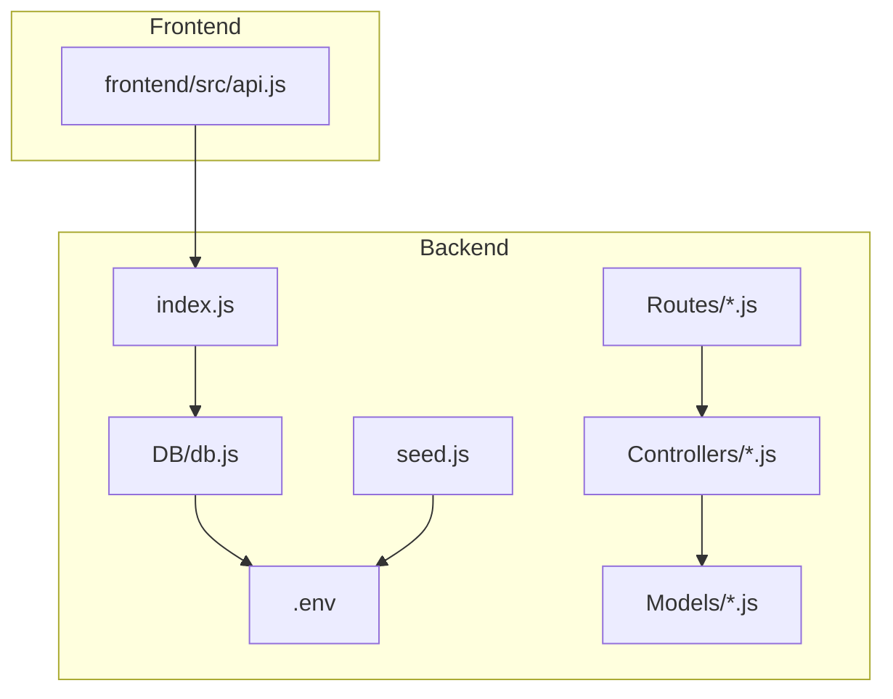
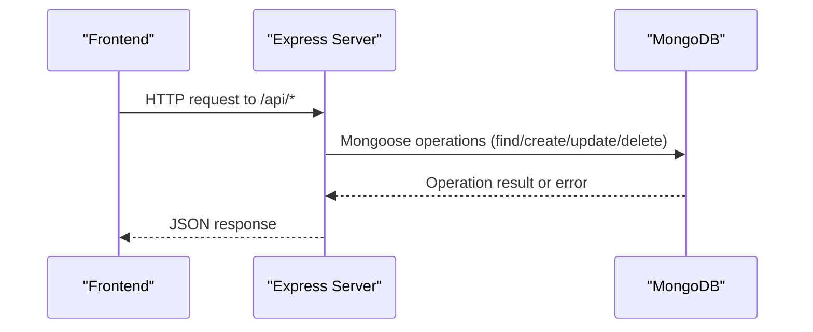
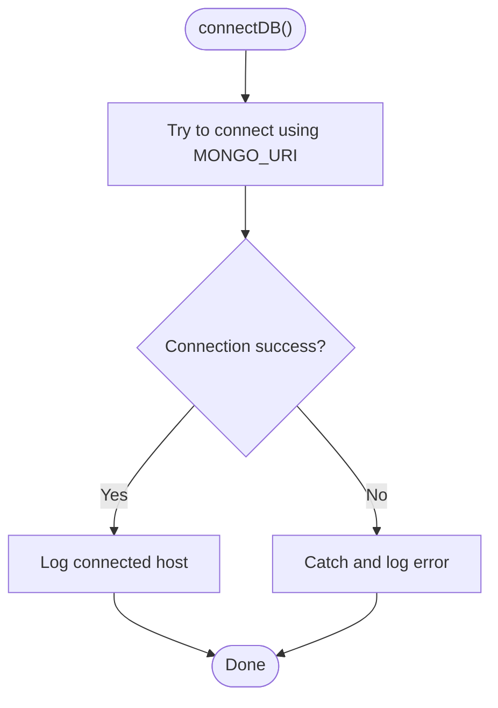
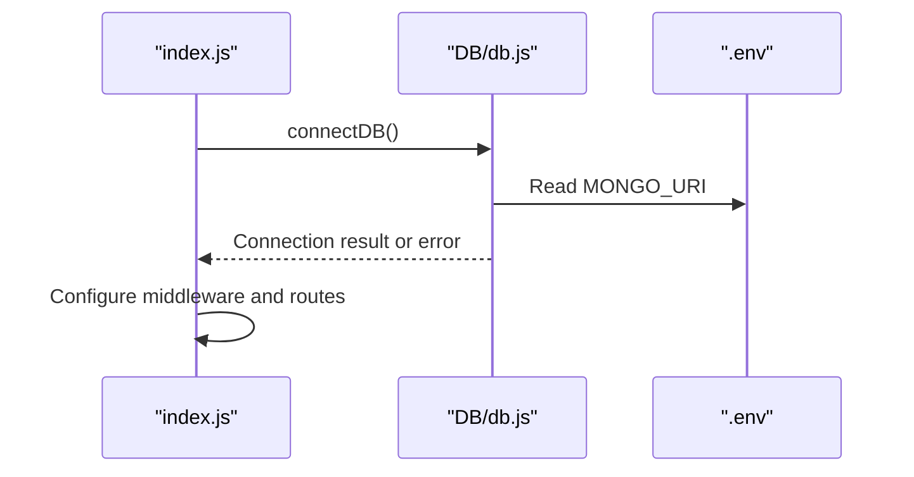
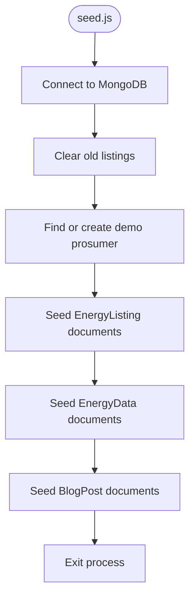
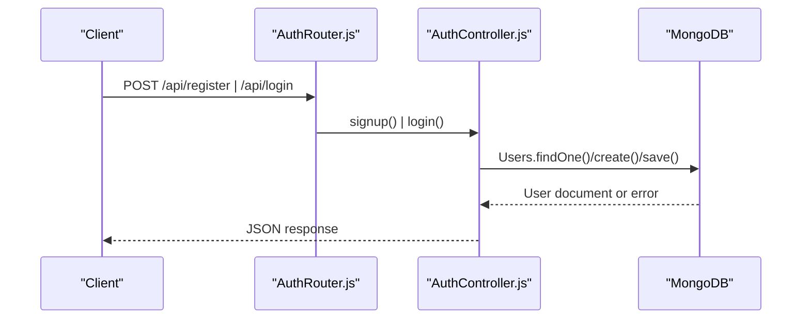
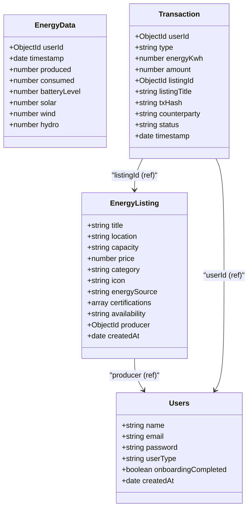
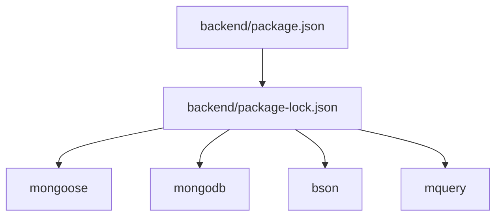

# Database Troubleshooting

<cite>
**Referenced Files in This Document**
- [db.js](file://backend/DB/db.js)
- [.env](file://backend/.env)
- [index.js](file://backend/index.js)
- [seed.js](file://backend/seed.js)
- [Users.js](file://backend/Models/Users.js)
- [EnergyListing.js](file://backend/Models/EnergyListing.js)
- [EnergyData.js](file://backend/Models/EnergyData.js)
- [Transaction.js](file://backend/Models/Transaction.js)
- [AuthController.js](file://backend/Controllers/AuthController.js)
- [AuthRouter.js](file://backend/Routes/AuthRouter.js)
- [package.json](file://backend/package.json)
- [package-lock.json](file://backend/package-lock.json)
- [api.js](file://frontend/src/api.js)
</cite>

## Table of Contents
1. [Introduction](#introduction)
2. [Project Structure](#project-structure)
3. [Core Components](#core-components)
4. [Architecture Overview](#architecture-overview)
5. [Detailed Component Analysis](#detailed-component-analysis)
6. [Dependency Analysis](#dependency-analysis)
7. [Performance Considerations](#performance-considerations)
8. [Troubleshooting Guide](#troubleshooting-guide)
9. [Conclusion](#conclusion)
10. [Appendices](#appendices)

## Introduction
This document provides comprehensive troubleshooting guidance for MongoDB database connectivity and performance issues in the project. It covers connection string configuration, authentication failures, SSL/TLS certificate issues, database seeding and schema validation errors, query performance optimization, connection pooling and timeouts, replica set connectivity, data consistency and transactions, diagnostics, and backup/recovery procedures. The goal is to help developers quickly diagnose and resolve database-related problems in development and production environments.

## Project Structure
The backend connects to MongoDB via Mongoose and exposes REST endpoints. The database connection is established at startup, and the seed script initializes initial data. Frontend communicates with the backend via HTTP requests.

**Diagram sources**
- [index.js](file://backend/index.js#L1-L97)
- [db.js](file://backend/DB/db.js#L1-L12)
- [.env](file://backend/.env#L1-L13)
- [seed.js](file://backend/seed.js#L1-L169)
- [AuthRouter.js](file://backend/Routes/AuthRouter.js#L1-L15)
- [AuthController.js](file://backend/Controllers/AuthController.js#L1-L482)
- [Users.js](file://backend/Models/Users.js#L1-L32)
- [EnergyListing.js](file://backend/Models/EnergyListing.js#L1-L56)
- [EnergyData.js](file://backend/Models/EnergyData.js#L1-L43)
- [Transaction.js](file://backend/Models/Transaction.js#L1-L51)
- [api.js](file://frontend/src/api.js#L1-L10)

**Section sources**
- [index.js](file://backend/index.js#L1-L97)
- [db.js](file://backend/DB/db.js#L1-L12)
- [.env](file://backend/.env#L1-L13)
- [seed.js](file://backend/seed.js#L1-L169)
- [AuthRouter.js](file://backend/Routes/AuthRouter.js#L1-L15)
- [AuthController.js](file://backend/Controllers/AuthController.js#L1-L482)
- [Users.js](file://backend/Models/Users.js#L1-L32)
- [EnergyListing.js](file://backend/Models/EnergyListing.js#L1-L56)
- [EnergyData.js](file://backend/Models/EnergyData.js#L1-L43)
- [Transaction.js](file://backend/Models/Transaction.js#L1-L51)
- [api.js](file://frontend/src/api.js#L1-L10)

## Core Components
- Database connection module establishes the Mongoose connection using the URI from environment variables.
- Environment configuration defines the MongoDB connection string and other secrets.
- Startup initialization triggers the database connection and sets up the HTTP server and WebSocket server.
- Seed script connects to the database and seeds initial data for listings, energy data, and blog posts.
- Models define schema constraints and relationships used by controllers and routes.
- Authentication controller handles user registration, login, and related flows that require database access.

Key implementation references:
- Connection establishment and logging: [db.js](file://backend/DB/db.js#L3-L10)
- Environment variables for connection and secrets: [.env](file://backend/.env#L1-L13)
- Startup connection call and server initialization: [index.js](file://backend/index.js#L26-L39)
- Seed script connection and seeding logic: [seed.js](file://backend/seed.js#L12-L168)
- Model schemas and constraints: [Users.js](file://backend/Models/Users.js#L3-L29), [EnergyListing.js](file://backend/Models/EnergyListing.js#L5-L53), [EnergyData.js](file://backend/Models/EnergyData.js#L3-L40), [Transaction.js](file://backend/Models/Transaction.js#L3-L48)
- Authentication flows using database: [AuthController.js](file://backend/Controllers/AuthController.js#L49-L154)

**Section sources**
- [db.js](file://backend/DB/db.js#L1-L12)
- [.env](file://backend/.env#L1-L13)
- [index.js](file://backend/index.js#L26-L39)
- [seed.js](file://backend/seed.js#L12-L168)
- [Users.js](file://backend/Models/Users.js#L1-L32)
- [EnergyListing.js](file://backend/Models/EnergyListing.js#L1-L56)
- [EnergyData.js](file://backend/Models/EnergyData.js#L1-L43)
- [Transaction.js](file://backend/Models/Transaction.js#L1-L51)
- [AuthController.js](file://backend/Controllers/AuthController.js#L49-L154)

## Architecture Overview
The backend uses Express with Mongoose for MongoDB access. On startup, the server attempts to connect to MongoDB using the configured URI. Routes delegate to controllers, which interact with models to perform CRUD operations. The frontend communicates with the backend via HTTP.

**Diagram sources**
- [index.js](file://backend/index.js#L41-L46)
- [AuthRouter.js](file://backend/Routes/AuthRouter.js#L1-L15)
- [AuthController.js](file://backend/Controllers/AuthController.js#L49-L154)
- [Users.js](file://backend/Models/Users.js#L1-L32)
- [EnergyListing.js](file://backend/Models/EnergyListing.js#L1-L56)
- [EnergyData.js](file://backend/Models/EnergyData.js#L1-L43)
- [Transaction.js](file://backend/Models/Transaction.js#L1-L51)

## Detailed Component Analysis

### Database Connectivity Module
The connection module wraps Mongoose.connect in a try/catch block and logs the host upon successful connection. It relies on the MONGO_URI environment variable.

**Diagram sources**
- [db.js](file://backend/DB/db.js#L3-L10)
- [.env](file://backend/.env#L2)

**Section sources**
- [db.js](file://backend/DB/db.js#L1-L12)
- [.env](file://backend/.env#L1-L13)

### Startup Initialization and Connection
The server calls connectDB during startup and proceeds to configure CORS, body parsing, routes, and Socket.IO. If the database connection fails, the server continues running without explicit failure handling in the connection module.

**Diagram sources**
- [index.js](file://backend/index.js#L26-L39)
- [db.js](file://backend/DB/db.js#L3-L10)
- [.env](file://backend/.env#L2)

**Section sources**
- [index.js](file://backend/index.js#L26-L39)
- [db.js](file://backend/DB/db.js#L1-L12)
- [.env](file://backend/.env#L1-L13)

### Database Seeding Script
The seed script connects to MongoDB using the same MONGO_URI, clears and inserts initial data for listings, energy data, and blog posts, and exits after completion. It depends on the presence of the Users model for a demo prosumer.

**Diagram sources**
- [seed.js](file://backend/seed.js#L12-L168)
- [Users.js](file://backend/Models/Users.js#L1-L32)
- [EnergyListing.js](file://backend/Models/EnergyListing.js#L1-L56)
- [EnergyData.js](file://backend/Models/EnergyData.js#L1-L43)

**Section sources**
- [seed.js](file://backend/seed.js#L1-L169)
- [Users.js](file://backend/Models/Users.js#L1-L32)
- [EnergyListing.js](file://backend/Models/EnergyListing.js#L1-L56)
- [EnergyData.js](file://backend/Models/EnergyData.js#L1-L43)

### Authentication Controller and Database Interactions
The authentication controller performs user registration, login, profile management, and password reset flows that require database access. It uses the Users model and related collections.

**Diagram sources**
- [AuthRouter.js](file://backend/Routes/AuthRouter.js#L7-L14)
- [AuthController.js](file://backend/Controllers/AuthController.js#L49-L154)
- [Users.js](file://backend/Models/Users.js#L1-L32)

**Section sources**
- [AuthRouter.js](file://backend/Routes/AuthRouter.js#L1-L15)
- [AuthController.js](file://backend/Controllers/AuthController.js#L49-L154)
- [Users.js](file://backend/Models/Users.js#L1-L32)

### Model Schemas and Validation
Model schemas define required fields, enums, uniqueness, and references. These constraints impact validation and seeding behavior.

**Diagram sources**
- [Users.js](file://backend/Models/Users.js#L3-L29)
- [EnergyListing.js](file://backend/Models/EnergyListing.js#L5-L53)
- [EnergyData.js](file://backend/Models/EnergyData.js#L3-L40)
- [Transaction.js](file://backend/Models/Transaction.js#L3-L48)

**Section sources**
- [Users.js](file://backend/Models/Users.js#L1-L32)
- [EnergyListing.js](file://backend/Models/EnergyListing.js#L1-L56)
- [EnergyData.js](file://backend/Models/EnergyData.js#L1-L43)
- [Transaction.js](file://backend/Models/Transaction.js#L1-L51)

## Dependency Analysis
The backend depends on Mongoose and MongoDB driver. The lock file shows the resolved versions and peer dependencies.

**Diagram sources**
- [package.json](file://backend/package.json#L13-L27)
- [package-lock.json](file://backend/package-lock.json#L1635-L1682)

**Section sources**
- [package.json](file://backend/package.json#L1-L29)
- [package-lock.json](file://backend/package-lock.json#L1635-L1682)

## Performance Considerations
- Connection pooling: Mongoose manages a pool internally. Tune pool size and timeouts at connection initialization for production workloads.
- Indexing: Create indexes on frequently queried fields (e.g., user email, listing producer, timestamps).
- Aggregation pipelines: Use $match early, limit projections, and avoid expensive $lookup operations when possible.
- Query optimization: Prefer exact matches over regex, and leverage compound indexes for multi-field filters.
- Transactions: Use Mongoose transactions for write-heavy operations requiring atomicity across collections.
- Monitoring: Enable slow query logging and track query execution stats in MongoDB.

[No sources needed since this section provides general guidance]

## Troubleshooting Guide

### Connection String Configuration Problems
Symptoms:
- Application starts but cannot connect to MongoDB.
- Frequent connection drops or timeouts.

Checklist:
- Verify MONGO_URI correctness in environment variables.
- Confirm the URI scheme matches the target cluster (e.g., mongodb+srv for Atlas).
- Ensure network access to the cluster (firewall, VPC, security groups).
- Validate DNS resolution for the cluster hostname.

References:
- Connection usage: [db.js](file://backend/DB/db.js#L5)
- Environment variable definition: [.env](file://backend/.env#L2)

**Section sources**
- [db.js](file://backend/DB/db.js#L1-L12)
- [.env](file://backend/.env#L1-L13)

### Authentication Failures
Symptoms:
- Login/signup returns authentication errors.
- JWT generation appears to succeed but subsequent protected routes fail.

Checklist:
- Confirm user exists and credentials match stored hash.
- Validate JWT_SECRET in environment variables.
- Ensure reCAPTCHA verification passes if enabled.
- Check email service configuration for password reset emails.

References:
- Login flow and JWT signing: [AuthController.js](file://backend/Controllers/AuthController.js#L105-L154)
- JWT secret usage: [.env](file://backend/.env#L3)
- Email service configuration: [.env](file://backend/.env#L5-L7)

**Section sources**
- [AuthController.js](file://backend/Controllers/AuthController.js#L105-L154)
- [.env](file://backend/.env#L1-L13)

### SSL/TLS Certificate Issues
Symptoms:
- TLS handshake failures or certificate validation errors.
- Mixed content warnings in browser when connecting to HTTPS endpoints.

Checklist:
- Ensure the MongoDB URI uses the correct scheme (mongodb+srv).
- Verify system trust stores include CA certificates.
- For self-signed certificates, configure appropriate TLS options in the connection string or driver settings.

References:
- Connection string usage: [db.js](file://backend/DB/db.js#L5)
- Driver and TLS dependencies: [package-lock.json](file://backend/package-lock.json#L1581-L1592)

**Section sources**
- [db.js](file://backend/DB/db.js#L1-L12)
- [package-lock.json](file://backend/package-lock.json#L1581-L1592)

### Database Seeding Problems
Symptoms:
- Seed script exits with connection or insertion errors.
- Initial data missing after running the seed.

Checklist:
- Confirm MONGO_URI is present and correct.
- Verify the seed script runs after the database is reachable.
- Review seed logic for required user existence and insertMany operations.

References:
- Seed connection and seeding: [seed.js](file://backend/seed.js#L12-L168)
- Required user for listings: [seed.js](file://backend/seed.js#L23-L37)
- Listing schema requirements: [EnergyListing.js](file://backend/Models/EnergyListing.js#L5-L53)

**Section sources**
- [seed.js](file://backend/seed.js#L1-L169)
- [EnergyListing.js](file://backend/Models/EnergyListing.js#L1-L56)

### Initial Data Loading Failures
Symptoms:
- Dashboard charts or marketplace listings empty.
- Blog posts not visible.

Checklist:
- Run the seed script to populate EnergyData and BlogPost collections.
- Confirm timestamps and categories align with expected values.

References:
- EnergyData seeding: [seed.js](file://backend/seed.js#L126-L139)
- Blog post seeding: [seed.js](file://backend/seed.js#L141-L160)

**Section sources**
- [seed.js](file://backend/seed.js#L126-L160)

### Schema Validation Errors
Symptoms:
- Insert/update operations fail with validation errors.
- Fields marked as required are missing.

Checklist:
- Review model schemas for required fields and enums.
- Ensure submitted data matches schema types and constraints.

References:
- Users schema: [Users.js](file://backend/Models/Users.js#L3-L29)
- EnergyListing schema: [EnergyListing.js](file://backend/Models/EnergyListing.js#L5-L53)
- EnergyData schema: [EnergyData.js](file://backend/Models/EnergyData.js#L3-L40)
- Transaction schema: [Transaction.js](file://backend/Models/Transaction.js#L3-L48)

**Section sources**
- [Users.js](file://backend/Models/Users.js#L1-L32)
- [EnergyListing.js](file://backend/Models/EnergyListing.js#L1-L56)
- [EnergyData.js](file://backend/Models/EnergyData.js#L1-L43)
- [Transaction.js](file://backend/Models/Transaction.js#L1-L51)

### Query Performance Optimization
Symptoms:
- Slow API responses for listing queries or dashboard data.
- High CPU usage on the database server.

Checklist:
- Identify slow queries using MongoDB profiling or application logs.
- Create indexes on frequent filter fields (e.g., producer, category, timestamps).
- Optimize aggregation pipelines by filtering early and limiting projections.
- Monitor query execution plans and adjust indexes accordingly.

References:
- Example of database operations in controllers: [AuthController.js](file://backend/Controllers/AuthController.js#L70-L87)

**Section sources**
- [AuthController.js](file://backend/Controllers/AuthController.js#L70-L87)

### Connection Pooling and Timeout Configurations
Symptoms:
- Connection exhaustion under load.
- Frequent timeouts on database operations.

Checklist:
- Configure Mongoose connection options for pool size and timeouts.
- Adjust keep-alive and socket options for production deployments.
- Monitor pool usage metrics and tune accordingly.

References:
- Mongoose version and dependencies: [package-lock.json](file://backend/package-lock.json#L1635-L1654)

**Section sources**
- [package-lock.json](file://backend/package-lock.json#L1635-L1654)

### Replica Set Connectivity Problems
Symptoms:
- Failures when connecting to replica set clusters.
- Primary election or secondary lag issues.

Checklist:
- Verify replica set URI format and authentication credentials.
- Ensure client supports replica set discovery and failover.
- Check network connectivity to all replica set members.

References:
- Connection string usage: [db.js](file://backend/DB/db.js#L5)

**Section sources**
- [db.js](file://backend/DB/db.js#L1-L12)

### Data Consistency and Transaction Failures
Symptoms:
- Partial writes or inconsistent state after failures.
- Race conditions in concurrent updates.

Checklist:
- Use Mongoose transactions for multi-document updates.
- Implement proper error handling and rollback logic.
- Validate referential integrity using populate and virtuals.

References:
- Transaction model schema: [Transaction.js](file://backend/Models/Transaction.js#L3-L48)

**Section sources**
- [Transaction.js](file://backend/Models/Transaction.js#L1-L51)

### Diagnostic Commands and Monitoring
- Health checks: Verify server startup logs and database connection logs.
- Query performance: Enable slow query log and analyze execution stats.
- Bottleneck identification: Monitor database and application metrics for hotspots.

References:
- Startup and connection logs: [index.js](file://backend/index.js#L26-L39), [db.js](file://backend/DB/db.js#L5-L6)

**Section sources**
- [index.js](file://backend/index.js#L26-L39)
- [db.js](file://backend/DB/db.js#L1-L12)

### Backup and Recovery Procedures
- Backups: Use MongoDB Atlas backups or mongodump for critical data.
- Recovery: Restore from backups and validate data integrity.
- Testing: Regularly test restore procedures to ensure recoverability.

[No sources needed since this section provides general guidance]

## Conclusion
This guide consolidates MongoDB connectivity, performance, and operational troubleshooting for the project. By validating connection strings, environment variables, model schemas, and implementing recommended performance and operational practices, teams can maintain reliable database operations across development and production environments.

## Appendices

### Quick Reference: Environment Variables
- MONGO_URI: MongoDB connection string.
- JWT_SECRET: Secret for JWT signing.
- EMAIL_SERVICE, EMAIL_USER, EMAIL_PASSWORD: Email service configuration.
- GOOGLE_CLIENT_ID, GOOGLE_CLIENT_SECRET: Google OAuth configuration.

References:
- Environment variables: [.env](file://backend/.env#L1-L13)

**Section sources**
- [.env](file://backend/.env#L1-L13)