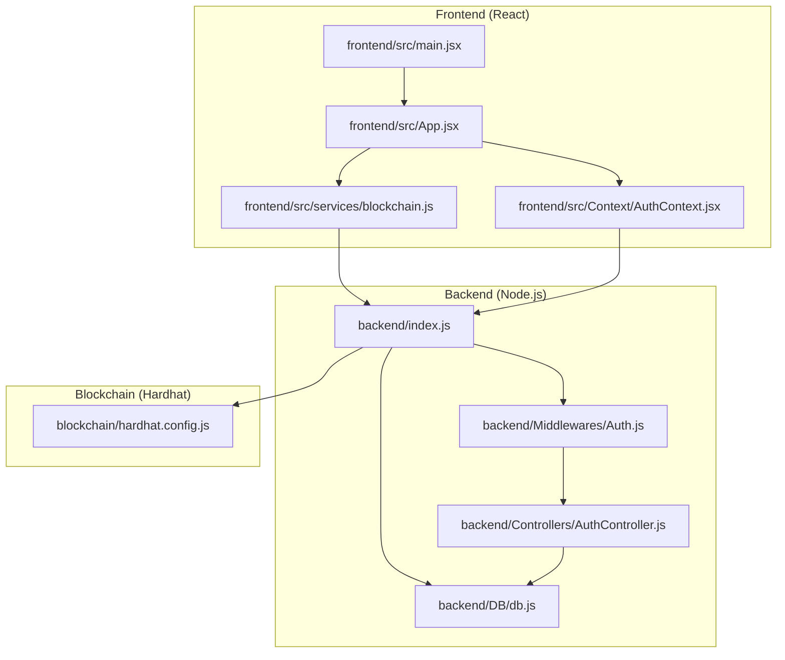
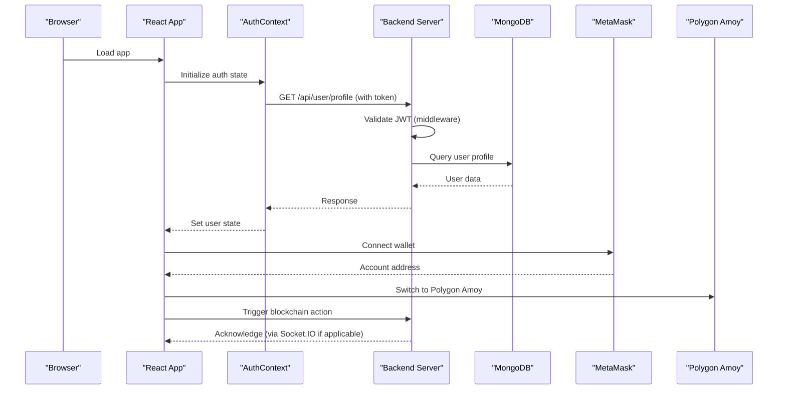
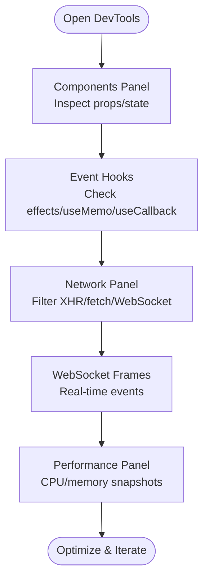
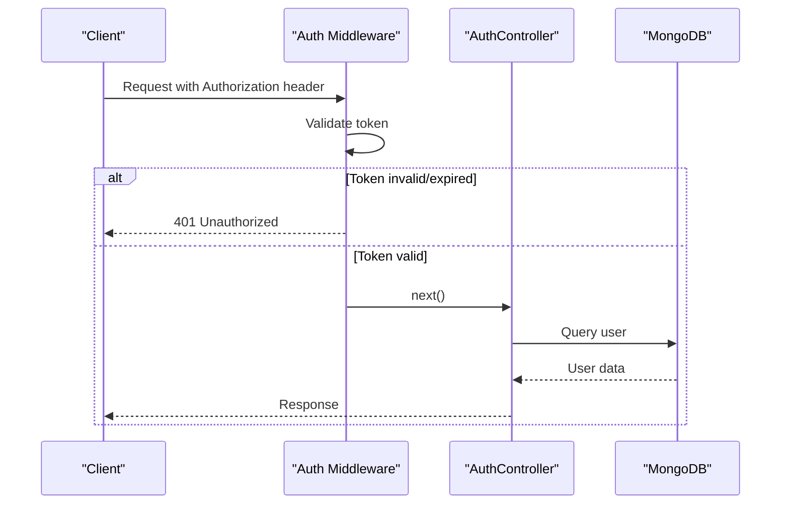
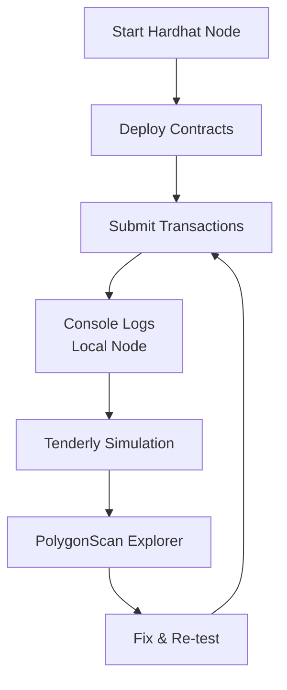
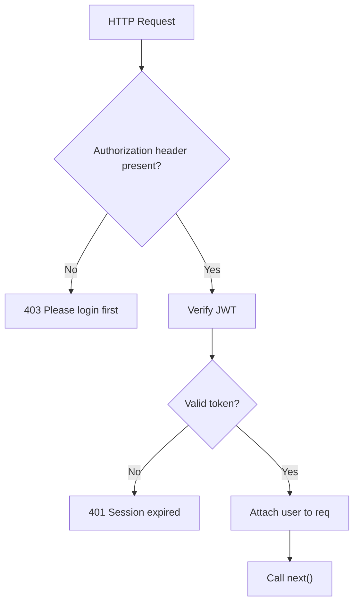
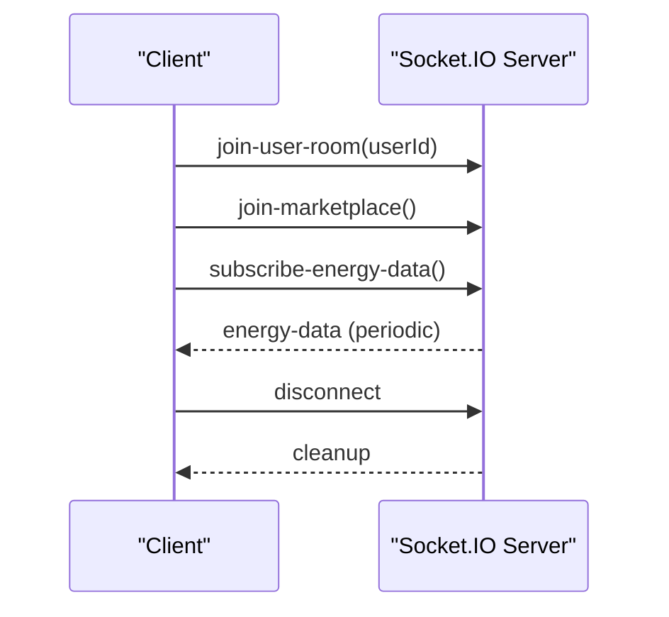
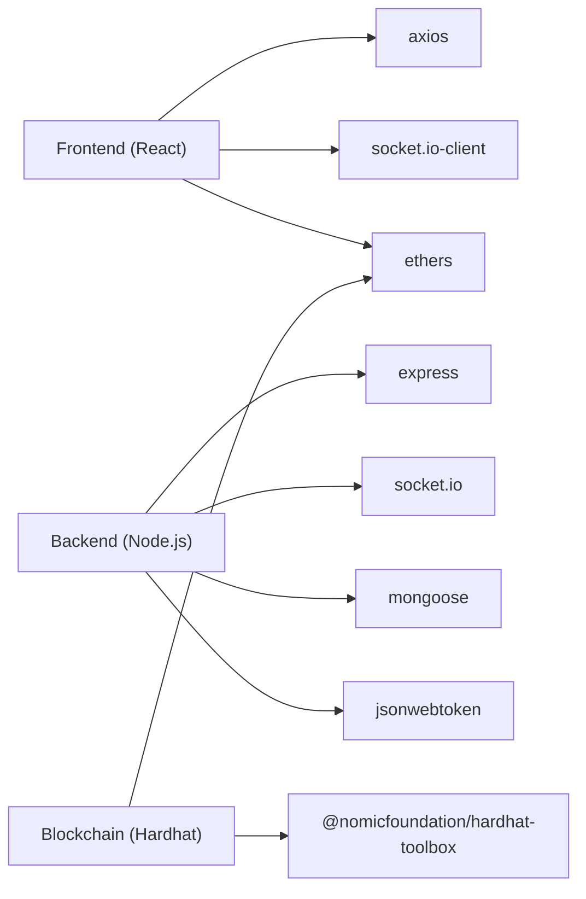

# Debugging Tools and Techniques

<cite>
**Referenced Files in This Document**
- [backend/package.json](file://backend/package.json)
- [frontend/package.json](file://frontend/package.json)
- [blockchain/package.json](file://blockchain/package.json)
- [backend/index.js](file://backend/index.js)
- [frontend/src/main.jsx](file://frontend/src/main.jsx)
- [frontend/src/App.jsx](file://frontend/src/App.jsx)
- [backend/.env](file://backend/.env)
- [frontend/.env](file://frontend/.env)
- [blockchain/.env](file://blockchain/.env)
- [backend/Middlewares/Auth.js](file://backend/Middlewares/Auth.js)
- [backend/Controllers/AuthController.js](file://backend/Controllers/AuthController.js)
- [backend/DB/db.js](file://backend/DB/db.js)
- [frontend/src/Context/AuthContext.jsx](file://frontend/src/Context/AuthContext.jsx)
- [frontend/src/services/blockchain.js](file://frontend/src/services/blockchain.js)
- [blockchain/hardhat.config.js](file://blockchain/hardhat.config.js)
</cite>

## Table of Contents
1. [Introduction](#introduction)
2. [Project Structure](#project-structure)
3. [Core Components](#core-components)
4. [Architecture Overview](#architecture-overview)
5. [Detailed Component Analysis](#detailed-component-analysis)
6. [Dependency Analysis](#dependency-analysis)
7. [Performance Considerations](#performance-considerations)
8. [Troubleshooting Guide](#troubleshooting-guide)
9. [Conclusion](#conclusion)
10. [Appendices](#appendices)

## Introduction
This document provides a comprehensive guide to debugging tools and techniques across all application layers of the EcoGrid platform. It covers:
- Browser developer tools usage for React applications, including React DevTools, Network inspection, and Performance profiling.
- Node.js debugging with inspector tools, logging strategies, and error tracking.
- Smart contract debugging using Hardhat console.log, Tenderly simulations, and blockchain explorers.
- Logging framework setup, structured logging, and log analysis techniques.
- Error tracking tools integration, exception handling, and crash reporting.
- Remote debugging capabilities, production error monitoring, and alerting systems.
- Step-by-step debugging workflows for common scenarios and advanced techniques for complex issues.
- Troubleshooting utilities and helper scripts for development workflow optimization.

## Project Structure
The project is organized into three primary layers:
- Frontend (React + Vite): Handles UI, routing, authentication state, and blockchain interactions.
- Backend (Node.js + Express + Socket.IO): Provides REST APIs, WebSocket connections, and database connectivity.
- Blockchain (Hardhat + Ethers): Manages smart contracts, local testing, and deployment configurations.

**Diagram sources**
- [frontend/src/main.jsx](file://frontend/src/main.jsx#L1-L15)
- [frontend/src/App.jsx](file://frontend/src/App.jsx#L1-L79)
- [frontend/src/Context/AuthContext.jsx](file://frontend/src/Context/AuthContext.jsx#L1-L70)
- [frontend/src/services/blockchain.js](file://frontend/src/services/blockchain.js#L1-L261)
- [backend/index.js](file://backend/index.js#L1-L97)
- [backend/DB/db.js](file://backend/DB/db.js#L1-L12)
- [backend/Middlewares/Auth.js](file://backend/Middlewares/Auth.js#L1-L19)
- [backend/Controllers/AuthController.js](file://backend/Controllers/AuthController.js#L1-L482)
- [blockchain/hardhat.config.js](file://blockchain/hardhat.config.js#L1-L12)

**Section sources**
- [frontend/package.json](file://frontend/package.json#L1-L50)
- [backend/package.json](file://backend/package.json#L1-L29)
- [blockchain/package.json](file://blockchain/package.json#L1-L11)

## Core Components
This section highlights the key components and their roles in debugging workflows:
- Frontend entrypoint initializes React and authentication provider.
- Backend server sets up Express, CORS, body parsing, Socket.IO, and periodic emissions for real-time energy data.
- Authentication middleware validates JWT tokens and attaches user context.
- Authentication controller implements signup, login, profile management, password reset, and Google OAuth flows with console logs for debugging.
- Database connection module logs MongoDB connection status.
- Blockchain service integrates MetaMask, manages contract interactions, and switches networks with console logs for diagnostics.

**Section sources**
- [frontend/src/main.jsx](file://frontend/src/main.jsx#L1-L15)
- [backend/index.js](file://backend/index.js#L1-L97)
- [backend/Middlewares/Auth.js](file://backend/Middlewares/Auth.js#L1-L19)
- [backend/Controllers/AuthController.js](file://backend/Controllers/AuthController.js#L1-L482)
- [backend/DB/db.js](file://backend/DB/db.js#L1-L12)
- [frontend/src/services/blockchain.js](file://frontend/src/services/blockchain.js#L1-L261)

## Architecture Overview
The system architecture supports debugging across layers via:
- Frontend React DevTools for component inspection and state debugging.
- Backend Node.js inspector for breakpoints and runtime inspection.
- Socket.IO for real-time event debugging and network traffic analysis.
- Blockchain Hardhat for smart contract debugging and Tenderly simulation for post-deployment analysis.

**Diagram sources**
- [frontend/src/App.jsx](file://frontend/src/App.jsx#L1-L79)
- [frontend/src/Context/AuthContext.jsx](file://frontend/src/Context/AuthContext.jsx#L1-L70)
- [backend/index.js](file://backend/index.js#L1-L97)
- [backend/Middlewares/Auth.js](file://backend/Middlewares/Auth.js#L1-L19)
- [backend/Controllers/AuthController.js](file://backend/Controllers/AuthController.js#L1-L482)
- [backend/DB/db.js](file://backend/DB/db.js#L1-L12)
- [frontend/src/services/blockchain.js](file://frontend/src/services/blockchain.js#L1-L261)

## Detailed Component Analysis

### Frontend: React Application Debugging
- React DevTools: Inspect component tree, props, and state. Use Profiler to detect unnecessary re-renders.
- Network inspection: Monitor API requests, authentication flows, and blockchain interactions. Observe WebSocket events for real-time updates.
- Performance profiling: Identify slow components, long tasks, and layout thrashing.
- Environment variables: Ensure REACT_APP_API_URL and VITE_SOCKET_URL are correctly configured for local debugging.

**Section sources**
- [frontend/src/main.jsx](file://frontend/src/main.jsx#L1-L15)
- [frontend/src/App.jsx](file://frontend/src/App.jsx#L1-L79)
- [frontend/.env](file://frontend/.env#L1-L7)

### Backend: Node.js Debugging
- Inspector tools: Use Node.js built-in inspector with --inspect flag or IDE attach. Set breakpoints in controllers and middleware.
- Logging strategies: Leverage console.log statements strategically placed in controllers and middleware. Centralize error logging for consistent analysis.
- Error tracking: Wrap route handlers in try/catch blocks and return structured JSON errors. Use middleware to normalize error responses.
- Real-time debugging: Inspect Socket.IO events and rooms to debug live updates.

**Diagram sources**
- [backend/Middlewares/Auth.js](file://backend/Middlewares/Auth.js#L1-L19)
- [backend/Controllers/AuthController.js](file://backend/Controllers/AuthController.js#L1-L482)
- [backend/DB/db.js](file://backend/DB/db.js#L1-L12)

**Section sources**
- [backend/index.js](file://backend/index.js#L1-L97)
- [backend/Middlewares/Auth.js](file://backend/Middlewares/Auth.js#L1-L19)
- [backend/Controllers/AuthController.js](file://backend/Controllers/AuthController.js#L1-L482)
- [backend/DB/db.js](file://backend/DB/db.js#L1-L12)
- [backend/.env](file://backend/.env#L1-L13)

### Blockchain: Smart Contract Debugging
- Hardhat console.log: Use console.log in Solidity contracts for on-chain debugging during local tests.
- Tenderly simulations: Deploy and simulate transactions off-chain to inspect gas usage, revert reasons, and state changes.
- Blockchain explorers: Use PolygonScan (Amoy) to inspect transactions, events, and contract interactions.
- Frontend debugging: Verify MetaMask connection, network switching, and contract ABI correctness.

**Diagram sources**
- [blockchain/hardhat.config.js](file://blockchain/hardhat.config.js#L1-L12)
- [frontend/src/services/blockchain.js](file://frontend/src/services/blockchain.js#L1-L261)

**Section sources**
- [blockchain/hardhat.config.js](file://blockchain/hardhat.config.js#L1-L12)
- [frontend/src/services/blockchain.js](file://frontend/src/services/blockchain.js#L1-L261)
- [blockchain/.env](file://blockchain/.env#L1-L2)

### Authentication Layer Debugging
- Token lifecycle: Validate token extraction, signature verification, and user attachment in middleware.
- Controller flows: Inspect signup, login, profile updates, password reset, and Google OAuth for error paths and console logs.
- Environment secrets: Ensure JWT_SECRET, EMAIL_* variables, and Google OAuth client IDs are loaded from .env.

**Diagram sources**
- [backend/Middlewares/Auth.js](file://backend/Middlewares/Auth.js#L1-L19)

**Section sources**
- [backend/Middlewares/Auth.js](file://backend/Middlewares/Auth.js#L1-L19)
- [backend/Controllers/AuthController.js](file://backend/Controllers/AuthController.js#L1-L482)
- [backend/.env](file://backend/.env#L1-L13)

### Real-Time Communication Debugging
- Socket.IO events: Monitor join-user-room, join-marketplace, subscribe-energy-data, and disconnect events.
- Periodic emissions: Confirm interval-based energy data emissions and client-side consumption.
- Frontend subscriptions: Ensure clients join appropriate rooms and handle incoming events.

**Diagram sources**
- [backend/index.js](file://backend/index.js#L48-L89)

**Section sources**
- [backend/index.js](file://backend/index.js#L1-L97)

## Dependency Analysis
This section maps external dependencies relevant to debugging:
- Frontend depends on React, Axios, Socket.IO client, and Ethers for blockchain interactions.
- Backend depends on Express, Socket.IO server, Mongoose for MongoDB, and JWT for authentication.
- Blockchain depends on Hardhat and Ethers for local development and testing.

**Diagram sources**
- [frontend/package.json](file://frontend/package.json#L1-L50)
- [backend/package.json](file://backend/package.json#L1-L29)
- [blockchain/package.json](file://blockchain/package.json#L1-L11)

**Section sources**
- [frontend/package.json](file://frontend/package.json#L1-L50)
- [backend/package.json](file://backend/package.json#L1-L29)
- [blockchain/package.json](file://blockchain/package.json#L1-L11)

## Performance Considerations
- Frontend:
  - Use React Profiler to identify expensive components and optimize rendering.
  - Minimize re-renders by memoizing props and avoiding unnecessary state updates.
  - Monitor network requests and reduce payload sizes.
- Backend:
  - Use Node.js profiler to identify CPU-intensive operations.
  - Optimize database queries and connection pooling.
  - Limit Socket.IO room sizes and avoid broadcasting to large audiences unnecessarily.
- Blockchain:
  - Reduce transaction gas usage by batching operations and optimizing contract logic.
  - Use Tenderly simulations to pre-test costly operations.

[No sources needed since this section provides general guidance]

## Troubleshooting Guide
Common debugging scenarios and steps:
- Frontend authentication fails:
  - Verify token presence and expiration in localStorage/sessionStorage.
  - Check API URL and credentials configuration.
  - Inspect network tab for 401/403 responses and review middleware logs.
- Backend database connection issues:
  - Confirm MONGO_URI and network connectivity.
  - Review connection logs and error messages.
- Socket.IO real-time updates not received:
  - Ensure clients join correct rooms and handle disconnects gracefully.
  - Verify periodic emission intervals and server logs.
- Blockchain interactions fail:
  - Confirm MetaMask installation and correct network (Polygon Amoy).
  - Validate contract addresses and ABI correctness.
  - Use Tenderly to simulate and inspect failures.

**Section sources**
- [frontend/src/Context/AuthContext.jsx](file://frontend/src/Context/AuthContext.jsx#L1-L70)
- [backend/DB/db.js](file://backend/DB/db.js#L1-L12)
- [backend/index.js](file://backend/index.js#L1-L97)
- [frontend/src/services/blockchain.js](file://frontend/src/services/blockchain.js#L1-L261)

## Conclusion
By integrating browser developer tools, Node.js inspector, Socket.IO event tracing, and blockchain debugging workflows, the EcoGrid platform can achieve robust visibility across all layers. Structured logging, centralized error handling, and environment-aware configurations enable efficient troubleshooting and maintainable debugging practices.

[No sources needed since this section summarizes without analyzing specific files]

## Appendices

### Step-by-Step Debugging Workflows
- React component debugging:
  - Open DevTools, navigate to Components panel, and inspect state and props.
  - Use Profiler to capture interactions and identify bottlenecks.
- Node.js API debugging:
  - Run backend with inspector enabled and attach IDE debugger.
  - Place breakpoints in middleware and controllers; monitor console logs.
- Socket.IO real-time debugging:
  - Observe connection events and room joins in Network panel.
  - Log emitted and received events on the server and client.
- Smart contract debugging:
  - Use Hardhat console.log during local tests.
  - Simulate transactions on Tenderly and analyze gas usage and reverts.
  - Inspect on-chain events and state changes via PolygonScan.

[No sources needed since this section provides general guidance]

### Best Practices for Logging and Error Tracking
- Use structured logging with consistent keys (timestamp, level, service, message).
- Centralize error handling with standardized response formats.
- Integrate with error tracking platforms (e.g., Sentry) for production monitoring.
- Instrument critical paths with metrics and traces for performance insights.

[No sources needed since this section provides general guidance]