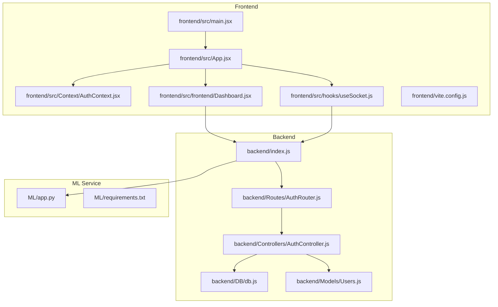
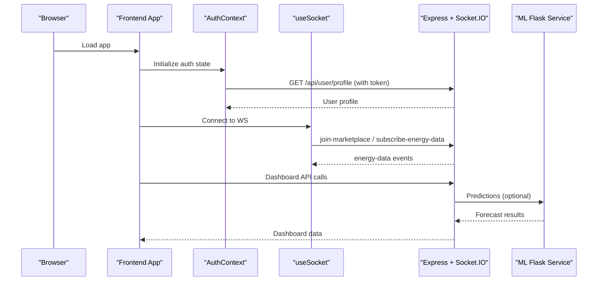
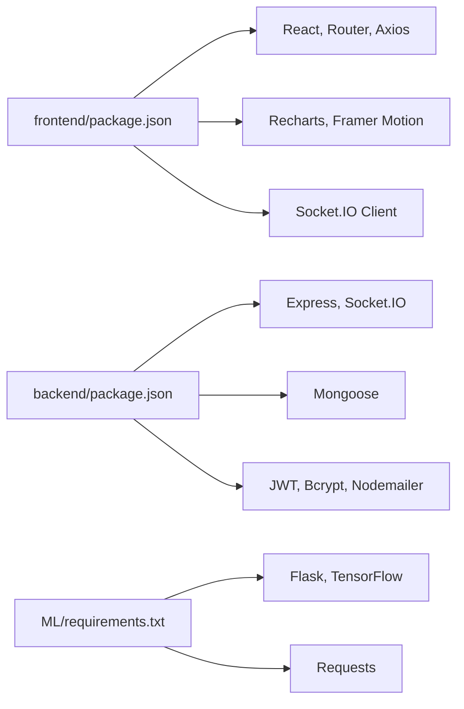

# Performance Optimization

<cite>
**Referenced Files in This Document**
- [frontend/src/main.jsx](file://frontend/src/main.jsx)
- [frontend/src/App.jsx](file://frontend/src/App.jsx)
- [frontend/src/Context/AuthContext.jsx](file://frontend/src/Context/AuthContext.jsx)
- [frontend/src/hooks/useSocket.js](file://frontend/src/hooks/useSocket.js)
- [frontend/src/frontend/Dashboard.jsx](file://frontend/src/frontend/Dashboard.jsx)
- [frontend/vite.config.js](file://frontend/vite.config.js)
- [frontend/package.json](file://frontend/package.json)
- [backend/index.js](file://backend/index.js)
- [backend/Routes/AuthRouter.js](file://backend/Routes/AuthRouter.js)
- [backend/Controllers/AuthController.js](file://backend/Controllers/AuthController.js)
- [backend/DB/db.js](file://backend/DB/db.js)
- [backend/Models/Users.js](file://backend/Models/Users.js)
- [backend/package.json](file://backend/package.json)
- [ML/app.py](file://ML/app.py)
- [ML/requirements.txt](file://ML/requirements.txt)
</cite>

## Table of Contents
1. [Introduction](#introduction)
2. [Project Structure](#project-structure)
3. [Core Components](#core-components)
4. [Architecture Overview](#architecture-overview)
5. [Detailed Component Analysis](#detailed-component-analysis)
6. [Dependency Analysis](#dependency-analysis)
7. [Performance Considerations](#performance-considerations)
8. [Troubleshooting Guide](#troubleshooting-guide)
9. [Conclusion](#conclusion)
10. [Appendices](#appendices)

## Introduction
This document provides a comprehensive performance optimization guide for the EcoGrid platform. It focuses on three pillars:
- Frontend rendering optimization and bundle size reduction
- Backend API performance tuning and database query optimization
- Machine learning service performance for model inference and API response time
- Real-time communication optimization via Socket.IO/WebSocket
- Profiling techniques, load testing, monitoring, and bottleneck identification
- Recommendations for different deployment environments and scaling scenarios

## Project Structure
The project is organized into three primary layers:
- Frontend (React + Vite): Handles routing, authentication, real-time updates, and UI rendering
- Backend (Express + Socket.IO): Provides REST APIs, authentication, and real-time events
- Machine Learning (Flask + TensorFlow/Keras): Powers energy forecasting and pricing predictions

**Diagram sources**
- [frontend/src/main.jsx](file://frontend/src/main.jsx#L1-L15)
- [frontend/src/App.jsx](file://frontend/src/App.jsx#L1-L79)
- [frontend/src/Context/AuthContext.jsx](file://frontend/src/Context/AuthContext.jsx#L1-L70)
- [frontend/src/hooks/useSocket.js](file://frontend/src/hooks/useSocket.js#L1-L142)
- [frontend/src/frontend/Dashboard.jsx](file://frontend/src/frontend/Dashboard.jsx#L1-L200)
- [frontend/vite.config.js](file://frontend/vite.config.js#L1-L18)
- [backend/index.js](file://backend/index.js#L1-L97)
- [backend/Routes/AuthRouter.js](file://backend/Routes/AuthRouter.js#L1-L15)
- [backend/Controllers/AuthController.js](file://backend/Controllers/AuthController.js#L1-L482)
- [backend/DB/db.js](file://backend/DB/db.js#L1-L12)
- [backend/Models/Users.js](file://backend/Models/Users.js#L1-L32)
- [ML/app.py](file://ML/app.py#L1-L251)
- [ML/requirements.txt](file://ML/requirements.txt#L1-L4)

**Section sources**
- [frontend/src/main.jsx](file://frontend/src/main.jsx#L1-L15)
- [frontend/src/App.jsx](file://frontend/src/App.jsx#L1-L79)
- [backend/index.js](file://backend/index.js#L1-L97)
- [ML/app.py](file://ML/app.py#L1-L251)

## Core Components
- Frontend entry and routing: Initializes the React app, sets up routing, and manages authentication state
- Authentication context: Centralizes token handling, user profile fetching, and loading states
- Real-time hook: Manages Socket.IO connections, rooms, and event listeners
- Backend server: Express server with Socket.IO, CORS configuration, and route registration
- ML inference service: Flask service that loads Keras models and performs forecasting/prediction
- Database connectivity: Mongoose connection for user and related models

Key performance levers:
- Frontend: Memoization, lazy loading, code splitting, and efficient state updates
- Backend: Request pipeline optimization, middleware ordering, database indexing, and caching
- ML: Model warmup, batch inference, and external API timeouts
- Real-time: Room management, throttling, and graceful reconnection

**Section sources**
- [frontend/src/App.jsx](file://frontend/src/App.jsx#L1-L79)
- [frontend/src/Context/AuthContext.jsx](file://frontend/src/Context/AuthContext.jsx#L1-L70)
- [frontend/src/hooks/useSocket.js](file://frontend/src/hooks/useSocket.js#L1-L142)
- [backend/index.js](file://backend/index.js#L1-L97)
- [ML/app.py](file://ML/app.py#L1-L251)
- [backend/DB/db.js](file://backend/DB/db.js#L1-L12)

## Architecture Overview
High-level runtime flow:
- Frontend initializes, authenticates, and subscribes to real-time updates
- Backend exposes REST endpoints and maintains Socket.IO rooms for real-time events
- ML service is invoked for forecasting; results are returned to the frontend
- Database operations are performed via Mongoose models

**Diagram sources**
- [frontend/src/App.jsx](file://frontend/src/App.jsx#L1-L79)
- [frontend/src/Context/AuthContext.jsx](file://frontend/src/Context/AuthContext.jsx#L1-L70)
- [frontend/src/hooks/useSocket.js](file://frontend/src/hooks/useSocket.js#L1-L142)
- [backend/index.js](file://backend/index.js#L1-L97)
- [ML/app.py](file://ML/app.py#L1-L251)

## Detailed Component Analysis

### Frontend Rendering Optimization
- Unnecessary re-renders
  - Move heavy computations outside of render scope and memoize derived data
  - Use shallow comparisons for props and avoid inline object/array creation in render
  - Prefer stable references for callbacks passed to child components
- Memory leaks
  - Ensure intervals and subscriptions are cleared on component unmount
  - Avoid closures capturing stale refs in long-lived effects
- Bundle size optimization
  - Leverage Vite’s tree-shaking and code splitting
  - Lazy-load non-critical routes and components
  - Minimize third-party dependencies and audit bundle composition

Recommended actions:
- Wrap frequently updated chart data with memoization and controlled updates
- Defer dashboard data fetches until after authentication resolves
- Split large pages into smaller chunks and prefetch critical resources

**Section sources**
- [frontend/src/App.jsx](file://frontend/src/App.jsx#L1-L79)
- [frontend/src/Context/AuthContext.jsx](file://frontend/src/Context/AuthContext.jsx#L1-L70)
- [frontend/src/frontend/Dashboard.jsx](file://frontend/src/frontend/Dashboard.jsx#L1-L200)
- [frontend/vite.config.js](file://frontend/vite.config.js#L1-L18)
- [frontend/package.json](file://frontend/package.json#L1-L50)

### Backend API Performance Tuning
- Request handling optimization
  - Order middleware to minimize overhead (CORS, body parsing, auth)
  - Validate and sanitize inputs early to fail fast
  - Use streaming for large payloads and compress responses
- Database query optimization
  - Ensure indexes on frequent filters (email, user ID)
  - Use lean queries and projection to reduce payload sizes
  - Batch writes and avoid N+1 queries
- Caching strategies
  - Cache read-heavy user data and static configuration
  - Use short TTLs for sensitive or frequently changing data
  - Implement cache warming during startup

Current observations:
- Authentication controller performs synchronous hashing and JWT signing; consider async-friendly patterns and rate limiting
- User profile retrieval populates related documents; ensure indexes exist and limit selected fields

**Section sources**
- [backend/index.js](file://backend/index.js#L1-L97)
- [backend/Routes/AuthRouter.js](file://backend/Routes/AuthRouter.js#L1-L15)
- [backend/Controllers/AuthController.js](file://backend/Controllers/AuthController.js#L1-L482)
- [backend/DB/db.js](file://backend/DB/db.js#L1-L12)
- [backend/Models/Users.js](file://backend/Models/Users.js#L1-L32)
- [backend/package.json](file://backend/package.json#L1-L29)

### Database Query Optimization
- Indexes
  - Email uniqueness on users; consider compound indexes for common joins
- Queries
  - Use aggregation pipelines for complex analytics
  - Paginate results and avoid fetching entire collections
- Connection management
  - Pool configuration and keep-alive settings
  - Retry logic for transient failures

Recommendations:
- Add indexes for user profile lookups and transaction queries
- Use explain plans to identify slow queries and missing indexes
- Monitor slow query logs and set thresholds for alerts

**Section sources**
- [backend/Models/Users.js](file://backend/Models/Users.js#L1-L32)
- [backend/DB/db.js](file://backend/DB/db.js#L1-L12)

### Machine Learning Service Performance
- Model inference optimization
  - Warm up models at startup and reuse loaded instances
  - Normalize inputs and pre-allocate arrays to reduce allocations
  - Use batching for multiple predictions
- API response time improvements
  - Set strict timeouts for external weather API calls
  - Cache weather forecasts per location and time window
  - Validate and normalize inputs before inference

Current observations:
- Models are lazily loaded; implement eager loading at service startup
- Weather API calls are synchronous; add timeouts and error handling
- Dynamic pricing computation is straightforward; ensure numerical stability

**Section sources**
- [ML/app.py](file://ML/app.py#L1-L251)
- [ML/requirements.txt](file://ML/requirements.txt#L1-L4)

### Real-Time Communication Optimization
- Socket.IO optimization
  - Use rooms efficiently; avoid joining every socket to multiple large rooms
  - Throttle emissions and coalesce updates
  - Implement exponential backoff and heartbeat checks
- WebSocket connection management
  - Detect and recover from network interruptions gracefully
  - Limit concurrent connections and enforce per-user limits
  - Close unused sockets proactively

Current observations:
- Backend emits periodic energy updates; tune interval and throttle
- Frontend listens to multiple event types; deduplicate handlers and manage lifecycle carefully

**Section sources**
- [backend/index.js](file://backend/index.js#L1-L97)
- [frontend/src/hooks/useSocket.js](file://frontend/src/hooks/useSocket.js#L1-L142)

## Dependency Analysis
Frontend dependencies include React, routing, real-time client, charts, and UI libraries. Backend depends on Express, Socket.IO, Mongoose, and authentication libraries. ML service relies on Flask, TensorFlow/Keras, and HTTP clients.

**Diagram sources**
- [frontend/package.json](file://frontend/package.json#L1-L50)
- [backend/package.json](file://backend/package.json#L1-L29)
- [ML/requirements.txt](file://ML/requirements.txt#L1-L4)

**Section sources**
- [frontend/package.json](file://frontend/package.json#L1-L50)
- [backend/package.json](file://backend/package.json#L1-L29)
- [ML/requirements.txt](file://ML/requirements.txt#L1-L4)

## Performance Considerations
- Profiling techniques
  - Browser: Use DevTools Performance and Memory panels; record interactions and analyze long tasks
  - Node.js: Use built-in inspector and profiler; analyze CPU and heap snapshots
  - Database: Enable slow query logging and use explain plans
- Load testing strategies
  - Simulate concurrent users for authentication, dashboard, and real-time updates
  - Measure response times and error rates under load
- Monitoring and alerting
  - Track latency, throughput, error rates, and resource utilization
  - Alert on regressions and threshold breaches
- Bottleneck identification
  - Iteratively disable features to isolate hotspots
  - Correlate metrics across frontend, backend, and ML service

[No sources needed since this section provides general guidance]

## Troubleshooting Guide
- Frontend
  - Excessive re-renders: Inspect component trees and memoize expensive computations
  - Memory growth: Verify intervals and event listeners are cleaned up
- Backend
  - Slow authentication: Check bcrypt cost and JWT signing overhead
  - Database timeouts: Add connection pooling and query timeouts
- ML service
  - Model load failures: Ensure model files exist and permissions are correct
  - External API errors: Add retries and circuit breaker logic
- Real-time
  - Disconnections: Implement reconnection with backoff and state reconciliation

**Section sources**
- [frontend/src/Context/AuthContext.jsx](file://frontend/src/Context/AuthContext.jsx#L1-L70)
- [frontend/src/hooks/useSocket.js](file://frontend/src/hooks/useSocket.js#L1-L142)
- [backend/Controllers/AuthController.js](file://backend/Controllers/AuthController.js#L1-L482)
- [ML/app.py](file://ML/app.py#L1-L251)

## Conclusion
Optimizing EcoGrid requires coordinated efforts across the frontend, backend, and ML service. Focus on reducing unnecessary work in React, optimizing database queries, minimizing ML inference latency, and managing real-time connections efficiently. Combine profiling, load testing, and continuous monitoring to sustain performance as the platform scales.

[No sources needed since this section summarizes without analyzing specific files]

## Appendices
- Deployment recommendations
  - Frontend: Enable compression, CDN, and cache headers; split bundles and lazy-load routes
  - Backend: Use clustered workers, connection pooling, and reverse proxy caching
  - ML: Containerize, scale horizontally, and cache predictions; monitor GPU/CPU utilization
- Scaling scenarios
  - Horizontal scaling: Stateless backend services behind a load balancer
  - Database: Sharding by user ID and read replicas for analytics
  - Real-time: Use Redis-backed Socket.IO clustering or managed pub/sub services

[No sources needed since this section provides general guidance]