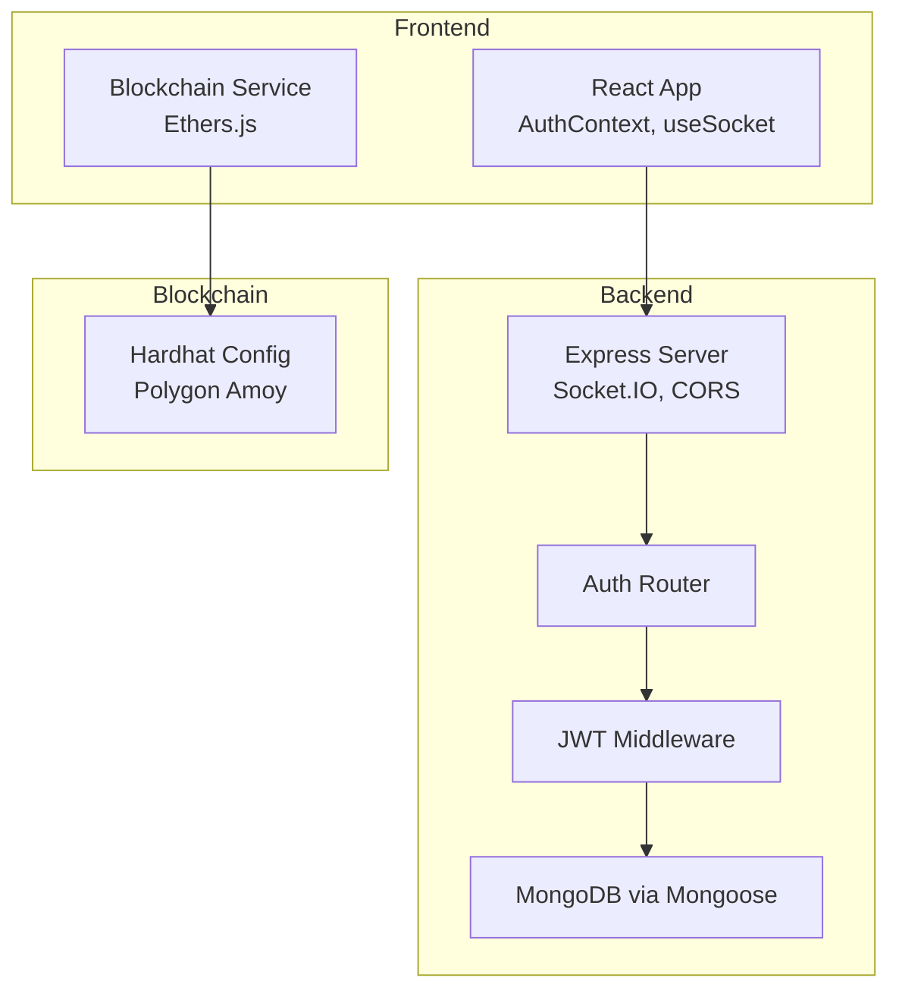
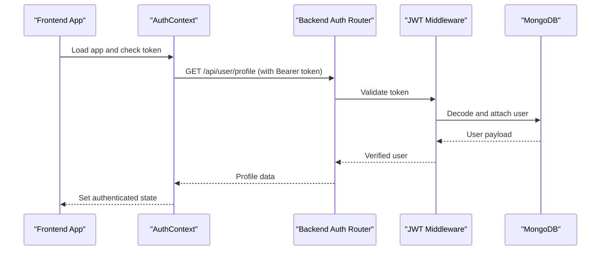
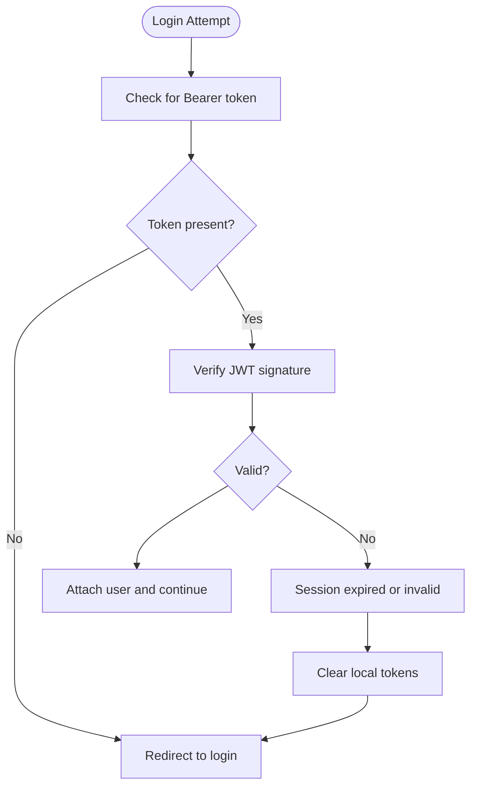
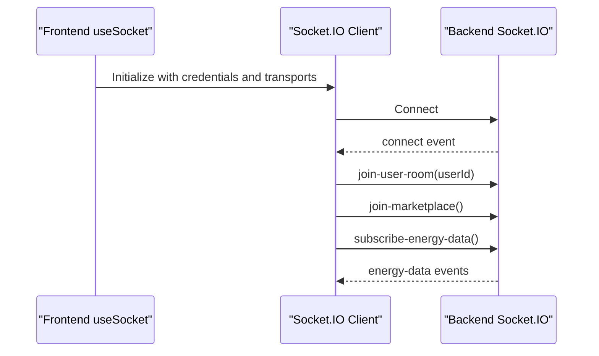
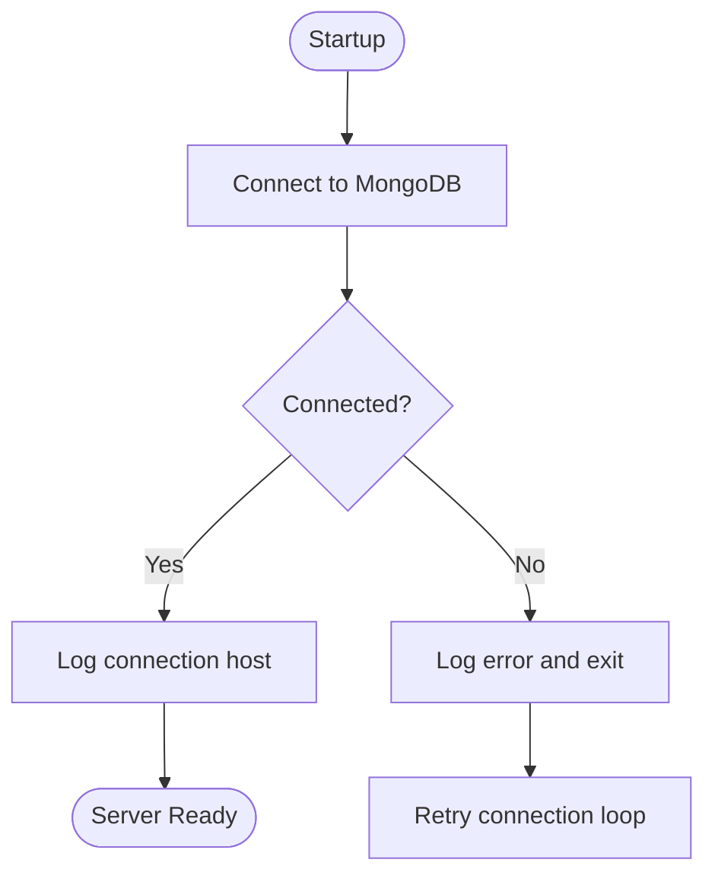
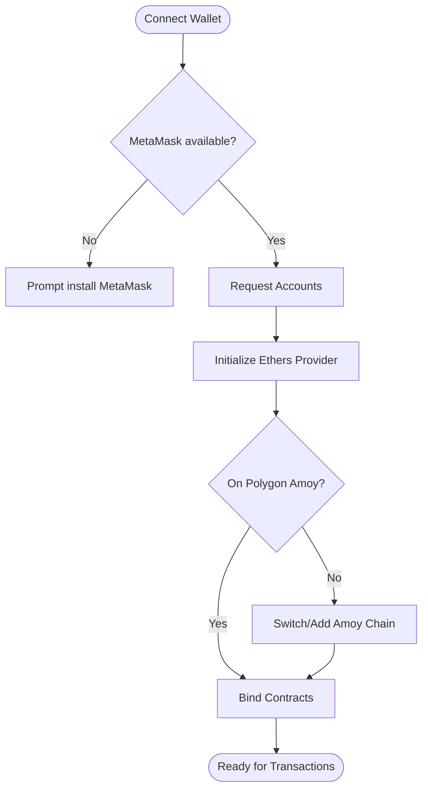
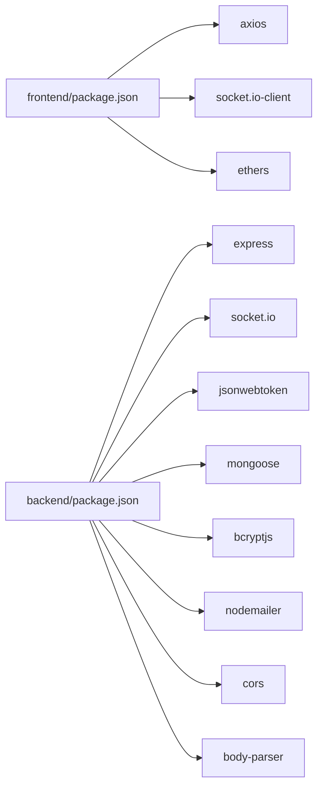

# Troubleshooting Guide

<cite>
**Referenced Files in This Document**
- [backend/index.js](file://backend/index.js)
- [backend/.env](file://backend/.env)
- [backend/Controllers/AuthController.js](file://backend/Controllers/AuthController.js)
- [backend/Middlewares/Auth.js](file://backend/Middlewares/Auth.js)
- [backend/Routes/AuthRouter.js](file://backend/Routes/AuthRouter.js)
- [backend/DB/db.js](file://backend/DB/db.js)
- [frontend/src/App.jsx](file://frontend/src/App.jsx)
- [frontend/src/Context/AuthContext.jsx](file://frontend/src/Context/AuthContext.jsx)
- [frontend/src/hooks/useSocket.js](file://frontend/src/hooks/useSocket.js)
- [frontend/src/services/blockchain.js](file://frontend/src/services/blockchain.js)
- [blockchain/hardhat.config.js](file://blockchain/hardhat.config.js)
- [backend/package.json](file://backend/package.json)
- [frontend/package.json](file://frontend/package.json)
</cite>

## Table of Contents
1. [Introduction](#introduction)
2. [Project Structure](#project-structure)
3. [Core Components](#core-components)
4. [Architecture Overview](#architecture-overview)
5. [Detailed Component Analysis](#detailed-component-analysis)
6. [Dependency Analysis](#dependency-analysis)
7. [Performance Considerations](#performance-considerations)
8. [Troubleshooting Guide](#troubleshooting-guide)
9. [Conclusion](#conclusion)
10. [Appendices](#appendices)

## Introduction
This troubleshooting guide provides a comprehensive, layered approach to diagnosing and resolving issues across the EcoGrid application stack. It covers authentication (JWT token expiration, session management, login failures), database connectivity and synchronization, blockchain integration (wallet connection, transactions, network), real-time communication (Socket.IO), performance optimization, debugging strategies, and preventive maintenance. The goal is to help developers and operators quickly identify root causes and apply targeted fixes while minimizing downtime.

## Project Structure
The application follows a modern full-stack architecture:
- Frontend: React SPA with Vite, Socket.IO client, and Ethers.js for blockchain interactions.
- Backend: Node.js/Express server with Socket.IO, JWT middleware, MongoDB via Mongoose, and routing for authentication and marketplace features.
- Blockchain: Hardhat-based Solidity contracts deployed to Polygon Amoy testnet, configured via environment variables.

**Diagram sources**
- [backend/index.js](file://backend/index.js#L1-L97)
- [backend/Routes/AuthRouter.js](file://backend/Routes/AuthRouter.js#L1-L15)
- [backend/Middlewares/Auth.js](file://backend/Middlewares/Auth.js#L1-L19)
- [backend/DB/db.js](file://backend/DB/db.js#L1-L12)
- [frontend/src/hooks/useSocket.js](file://frontend/src/hooks/useSocket.js#L1-L142)
- [frontend/src/services/blockchain.js](file://frontend/src/services/blockchain.js#L1-L261)
- [blockchain/hardhat.config.js](file://blockchain/hardhat.config.js#L1-L12)

**Section sources**
- [backend/index.js](file://backend/index.js#L1-L97)
- [backend/Routes/AuthRouter.js](file://backend/Routes/AuthRouter.js#L1-L15)
- [frontend/src/hooks/useSocket.js](file://frontend/src/hooks/useSocket.js#L1-L142)
- [frontend/src/services/blockchain.js](file://frontend/src/services/blockchain.js#L1-L261)
- [blockchain/hardhat.config.js](file://blockchain/hardhat.config.js#L1-L12)

## Core Components
- Authentication and Session Management
  - Backend JWT middleware validates tokens and attaches user context to requests.
  - Frontend AuthContext persists tokens and refreshes user profiles on load.
  - Google OAuth and reCAPTCHA are integrated for secure sign-in.
- Real-Time Communication
  - Backend emits periodic energy data to clients via Socket.IO rooms.
  - Frontend connects with credentials and listens for events.
- Database Connectivity
  - MongoDB connection established via Mongoose; logs connection status.
- Blockchain Integration
  - Ethers.js provider/signer initialization, contract bindings, and chain switching for Polygon Amoy.

**Section sources**
- [backend/Middlewares/Auth.js](file://backend/Middlewares/Auth.js#L1-L19)
- [frontend/src/Context/AuthContext.jsx](file://frontend/src/Context/AuthContext.jsx#L1-L70)
- [backend/Controllers/AuthController.js](file://backend/Controllers/AuthController.js#L105-L155)
- [backend/index.js](file://backend/index.js#L48-L97)
- [frontend/src/hooks/useSocket.js](file://frontend/src/hooks/useSocket.js#L1-L142)
- [backend/DB/db.js](file://backend/DB/db.js#L1-L12)
- [frontend/src/services/blockchain.js](file://frontend/src/services/blockchain.js#L52-L130)

## Architecture Overview
End-to-end flows for authentication, real-time updates, and blockchain interactions are orchestrated through the backend server and Socket.IO, with the frontend consuming events and interacting with blockchain contracts.

**Diagram sources**
- [frontend/src/Context/AuthContext.jsx](file://frontend/src/Context/AuthContext.jsx#L17-L46)
- [backend/Routes/AuthRouter.js](file://backend/Routes/AuthRouter.js#L10-L10)
- [backend/Middlewares/Auth.js](file://backend/Middlewares/Auth.js#L3-L18)
- [backend/Controllers/AuthController.js](file://backend/Controllers/AuthController.js#L196-L219)

## Detailed Component Analysis

### Authentication and Session Management
Common issues:
- Token expiration and invalidation
- Missing or malformed Bearer token
- Frontend token persistence inconsistencies
- Email/password login failures and rate limiting via reCAPTCHA

Resolution steps:
- Confirm JWT_SECRET is set consistently in backend environment.
- Ensure frontend stores tokens in a secure, persistent manner and sends Authorization header with Bearer prefix.
- Validate reCAPTCHA token presence and correctness on registration and login.
- On token failure, redirect to login and clear stored tokens.

**Diagram sources**
- [backend/Middlewares/Auth.js](file://backend/Middlewares/Auth.js#L3-L18)
- [frontend/src/Context/AuthContext.jsx](file://frontend/src/Context/AuthContext.jsx#L17-L46)

**Section sources**
- [backend/Middlewares/Auth.js](file://backend/Middlewares/Auth.js#L1-L19)
- [backend/Controllers/AuthController.js](file://backend/Controllers/AuthController.js#L105-L155)
- [backend/Routes/AuthRouter.js](file://backend/Routes/AuthRouter.js#L1-L15)
- [frontend/src/Context/AuthContext.jsx](file://frontend/src/Context/AuthContext.jsx#L1-L70)

### Real-Time Communication (Socket.IO)
Common issues:
- Connection refused or dropped
- Events not received due to missing room subscriptions
- CORS misconfiguration blocking connections

Resolution steps:
- Verify backend Socket.IO server runs and CORS allows frontend origin.
- Ensure frontend initializes connection with credentials and transport fallbacks.
- Subscribe to rooms (user room, marketplace, energy updates) after connecting.

**Diagram sources**
- [frontend/src/hooks/useSocket.js](file://frontend/src/hooks/useSocket.js#L12-L88)
- [backend/index.js](file://backend/index.js#L48-L86)

**Section sources**
- [frontend/src/hooks/useSocket.js](file://frontend/src/hooks/useSocket.js#L1-L142)
- [backend/index.js](file://backend/index.js#L18-L97)

### Database Connectivity and Synchronization
Common issues:
- Connection string errors
- Network timeouts or replica set issues
- Synchronization delays between collections

Resolution steps:
- Validate MONGO_URI in backend environment.
- Confirm MongoDB availability and firewall rules.
- Monitor connection logs and retry connection on startup.

**Diagram sources**
- [backend/DB/db.js](file://backend/DB/db.js#L3-L10)

**Section sources**
- [backend/DB/db.js](file://backend/DB/db.js#L1-L12)
- [backend/.env](file://backend/.env#L2-L2)

### Blockchain Integration
Common issues:
- Wallet not detected or accounts unavailable
- Wrong network or chain mismatch
- Contracts not configured or addresses empty
- Transaction submission failures

Resolution steps:
- Detect MetaMask availability and request accounts.
- Switch to Polygon Amoy if needed; add chain if missing.
- Ensure contract addresses are configured in frontend environment.
- Handle transaction waits and parse errors gracefully.

**Diagram sources**
- [frontend/src/services/blockchain.js](file://frontend/src/services/blockchain.js#L52-L130)

**Section sources**
- [frontend/src/services/blockchain.js](file://frontend/src/services/blockchain.js#L1-L261)
- [blockchain/hardhat.config.js](file://blockchain/hardhat.config.js#L1-L12)

## Dependency Analysis
Runtime dependencies across layers influence stability and performance.

**Diagram sources**
- [frontend/package.json](file://frontend/package.json#L12-L32)
- [backend/package.json](file://backend/package.json#L13-L26)

**Section sources**
- [frontend/package.json](file://frontend/package.json#L1-L50)
- [backend/package.json](file://backend/package.json#L1-L29)

## Performance Considerations
Frontend:
- Minimize heavy computations in render paths; memoize derived data.
- Lazy-load non-critical routes and components.
- Debounce frequent API calls and throttle real-time event handlers.

Backend:
- Optimize route handlers and avoid synchronous I/O.
- Use connection pooling and limit concurrent requests.
- Index MongoDB collections for frequent queries (e.g., user profile lookups).

Blockchain:
- Batch transactions where possible; estimate gas and fees.
- Poll or listen for events efficiently; avoid polling loops.

Real-time:
- Use room-based broadcasting to reduce unnecessary emissions.
- Throttle high-frequency events (e.g., energy data intervals).

[No sources needed since this section provides general guidance]

## Troubleshooting Guide

### Authentication Problems
Symptoms:
- 403 Unauthorized on protected routes.
- 401 Session expired prompts.
- Login fails with reCAPTCHA errors.

Checklist:
- Confirm JWT_SECRET is set in backend environment.
- Verify Authorization header format (Bearer token).
- Ensure reCAPTCHA token is submitted and verified.
- Clear stale tokens from localStorage/sessionStorage if login fails.

Resolution steps:
- Re-login to refresh token.
- If middleware rejects token, force logout and redirect to login.
- Validate reCAPTCHA secret key and network reachability.

**Section sources**
- [backend/Middlewares/Auth.js](file://backend/Middlewares/Auth.js#L3-L18)
- [backend/Controllers/AuthController.js](file://backend/Controllers/AuthController.js#L105-L155)
- [backend/.env](file://backend/.env#L3-L3)
- [frontend/src/Context/AuthContext.jsx](file://frontend/src/Context/AuthContext.jsx#L17-L46)

### Session Management Issues
Symptoms:
- Redirect loops to login despite having a token.
- Profile fetch failing intermittently.

Checklist:
- Confirm withCredentials enabled in frontend API client.
- Ensure token storage keys are consistent (authToken).
- Validate backend CORS allows credentials.

Resolution steps:
- Clear tokens and reload to re-authenticate.
- Confirm backend sets io instance for routes and Socket.IO is initialized.

**Section sources**
- [frontend/src/Context/AuthContext.jsx](file://frontend/src/Context/AuthContext.jsx#L12-L15)
- [backend/index.js](file://backend/index.js#L38-L38)

### Login Failures
Symptoms:
- Incorrect credentials rejected.
- Rate-limited by reCAPTCHA.

Checklist:
- Verify email exists and password hashes match.
- Confirm reCAPTCHA verification succeeds.

Resolution steps:
- Retry with correct credentials.
- Ensure reCAPTCHA is enabled and secret key is valid.

**Section sources**
- [backend/Controllers/AuthController.js](file://backend/Controllers/AuthController.js#L105-L155)
- [backend/.env](file://backend/.env#L9-L9)

### Database Connectivity Issues
Symptoms:
- Application fails to start or logs connection errors.
- Queries timeout or fail intermittently.

Checklist:
- Validate MONGO_URI in environment.
- Confirm MongoDB is reachable and credentials are correct.
- Review connection logs on startup.

Resolution steps:
- Fix URI and network access.
- Restart backend after resolving connectivity.

**Section sources**
- [backend/DB/db.js](file://backend/DB/db.js#L3-L10)
- [backend/.env](file://backend/.env#L2-L2)

### Connection Pooling and Data Synchronization
Symptoms:
- Slow responses under load.
- Occasional duplicate or stale data.

Checklist:
- Use connection pooling in production deployments.
- Ensure proper indexing on user and profile collections.
- Implement idempotent writes for sensitive operations.

Resolution steps:
- Scale database connections and optimize queries.
- Add indexes for frequent filters (e.g., email, user ID).

[No sources needed since this section provides general guidance]

### Blockchain Integration Challenges
Symptoms:
- Wallet not detected.
- Wrong network selected.
- Transaction submission errors.

Checklist:
- Confirm MetaMask installed and accounts unlocked.
- Verify Polygon Amoy RPC URL and private key in environment.
- Ensure contract addresses are configured in frontend.

Resolution steps:
- Install MetaMask and unlock accounts.
- Switch/add Amoy chain if needed.
- Re-deploy contracts and update frontend addresses.

**Section sources**
- [frontend/src/services/blockchain.js](file://frontend/src/services/blockchain.js#L52-L130)
- [blockchain/hardhat.config.js](file://blockchain/hardhat.config.js#L4-L12)

### Wallet Connection Failures
Symptoms:
- “MetaMask is not installed” thrown.
- Chain switch fails.

Resolution steps:
- Install MetaMask and refresh page.
- Trigger chain switch and confirm in wallet UI.
- Handle switch errors and fallbacks.

**Section sources**
- [frontend/src/services/blockchain.js](file://frontend/src/services/blockchain.js#L52-L130)

### Transaction Submission Errors
Symptoms:
- Transaction hangs or reverts.
- No receipt or hash returned.

Resolution steps:
- Wait for transaction confirmation.
- Inspect transaction hash and receipts.
- Adjust gas price/limit and retry.

**Section sources**
- [frontend/src/services/blockchain.js](file://frontend/src/services/blockchain.js#L164-L188)
- [frontend/src/services/blockchain.js](file://frontend/src/services/blockchain.js#L190-L202)

### Network Connectivity Issues
Symptoms:
- Socket.IO handshake fails.
- CORS blocked requests.

Resolution steps:
- Verify backend CORS origin matches frontend URL.
- Ensure port forwarding/firewall allows WebSocket traffic.
- Test network reachability to MongoDB and blockchain RPC endpoints.

**Section sources**
- [backend/index.js](file://backend/index.js#L18-L34)
- [backend/index.js](file://backend/index.js#L94-L97)

### Socket.IO Connection Problems
Symptoms:
- Connection drops or never establishes.
- Events not received.

Resolution steps:
- Confirm frontend initializes with credentials and transports.
- Subscribe to rooms after connect.
- Check backend logs for connection/disconnect events.

**Section sources**
- [frontend/src/hooks/useSocket.js](file://frontend/src/hooks/useSocket.js#L12-L88)
- [backend/index.js](file://backend/index.js#L48-L73)

### Event Delivery Failures
Symptoms:
- Missing energy updates or marketplace notifications.

Resolution steps:
- Ensure client emits subscribe events after connection.
- Verify backend joins clients to appropriate rooms.
- Confirm periodic emissions are active.

**Section sources**
- [frontend/src/hooks/useSocket.js](file://frontend/src/hooks/useSocket.js#L36-L82)
- [backend/index.js](file://backend/index.js#L75-L86)

### Performance Optimization
Frontend:
- Defer non-critical work; use efficient state updates.
- Limit real-time event frequency and batch UI updates.

Backend:
- Use pagination and selective field projections.
- Cache infrequent reads; monitor slow queries.

Blockchain:
- Estimate gas and reuse allowances.
- Avoid excessive polling; use event listeners.

[No sources needed since this section provides general guidance]

### Debugging Strategies
Logging:
- Enable verbose logs in backend startup and Socket.IO handlers.
- Capture frontend connection lifecycle and error events.

Error Tracking:
- Integrate client-side error reporting for uncaught exceptions.
- Track backend error responses and middleware failures.

Development Console:
- Inspect network tab for failed requests and CORS errors.
- Use browser devtools to verify token presence and Socket.IO events.

**Section sources**
- [backend/index.js](file://backend/index.js#L48-L97)
- [frontend/src/hooks/useSocket.js](file://frontend/src/hooks/useSocket.js#L31-L34)
- [frontend/src/Context/AuthContext.jsx](file://frontend/src/Context/AuthContext.jsx#L34-L42)

### Step-by-Step Resolution Guides

Critical System Failure Recovery:
- Backend crash or restart
  - Check startup logs for database connection errors.
  - Validate environment variables and restart service.
  - Confirm Socket.IO server binds to correct port.

- Frontend authentication loop
  - Clear authToken from storage.
  - Reload and re-authenticate.
  - Verify JWT middleware and token format.

- Socket.IO outage
  - Verify backend CORS and port accessibility.
  - Restart backend; ensure periodic emissions are scheduled.
  - Confirm frontend reconnects and re-subscribes.

- Blockchain network down
  - Check RPC URL reachability.
  - Switch to a reliable RPC provider.
  - Retry transaction submissions after network recovery.

**Section sources**
- [backend/DB/db.js](file://backend/DB/db.js#L3-L10)
- [backend/index.js](file://backend/index.js#L94-L97)
- [frontend/src/Context/AuthContext.jsx](file://frontend/src/Context/AuthContext.jsx#L17-L46)
- [frontend/src/hooks/useSocket.js](file://frontend/src/hooks/useSocket.js#L12-L88)
- [frontend/src/services/blockchain.js](file://frontend/src/services/blockchain.js#L103-L130)

### Preventive Maintenance and Monitoring
- Environment hygiene
  - Store secrets in backend .env and frontend Vite env files.
  - Rotate JWT_SECRET and reCAPTCHA keys periodically.

- Health checks
  - Expose readiness/liveness endpoints for backend.
  - Monitor Socket.IO client counts and event throughput.

- Observability
  - Centralize backend logs and correlate with frontend error reports.
  - Track database query latency and connection pool metrics.

- Security
  - Enforce HTTPS and secure cookies in production.
  - Validate all inputs and sanitize user-provided data.

**Section sources**
- [backend/.env](file://backend/.env#L1-L13)
- [frontend/.env](file://frontend/.env)
- [backend/package.json](file://backend/package.json#L1-L29)
- [frontend/package.json](file://frontend/package.json#L1-L50)

## Conclusion
By systematically validating environment configuration, connection settings, and component health across authentication, real-time, database, and blockchain layers, most issues can be resolved quickly. Adopting robust logging, error tracking, and preventive maintenance ensures early detection and resilience against common failure modes.

## Appendices
- Quick reference: Ensure MONGO_URI, JWT_SECRET, RECAPTCHA_SECRET_KEY, GOOGLE_CLIENT_ID/SECRET, and blockchain RPC/private key are set and correct.
- Checklist: After changes, restart backend, clear frontend storage, and re-authenticate; verify Socket.IO events and blockchain transactions.

[No sources needed since this section provides general guidance]